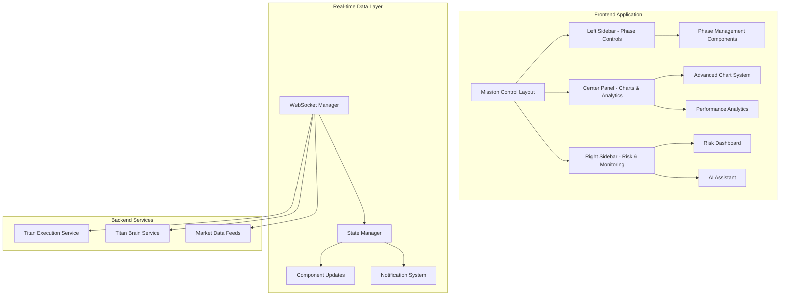

# Design Document

## Overview

The Titan Frontend Transformation will create a NASA-style mission control center for algorithmic trading, built on Next.js 15+ with React 19+ and TypeScript. The system leverages shadcn/ui components to provide institutional-grade trading capabilities with sub-100ms real-time performance. The architecture follows a modular component design with centralized state management and WebSocket-based real-time data flow.

## Architecture

### High-Level Architecture



### Component Architecture

The system follows a hierarchical component structure:

```
MissionControlLayout (Root Container)
├── EmergencyControlBar (Fixed Top)
├── ResizablePanelGroup (Main Content)
│   ├── LeftSidebar (Phase Controls)
│   │   ├── PhaseStatusCards
│   │   ├── QuickActions
│   │   └── SystemHealth
│   ├── CenterPanel (Primary Content)
│   │   ├── AdvancedChartSystem
│   │   ├── PerformanceAnalytics
│   │   └── TradingViewIntegration
│   └── RightSidebar (Monitoring)
│       ├── RiskDashboard
│       ├── AIAssistant
│       └── NotificationCenter
└── StatusBar (Fixed Bottom)
```

## Components and Interfaces

### Core Layout Components

#### MissionControlLayout
```typescript
interface MissionControlLayoutProps {
  children: React.ReactNode;
  emergencyMode?: boolean;
  multiScreenMode?: boolean;
}

interface LayoutState {
  leftSidebarWidth: number;
  rightSidebarWidth: number;
  leftSidebarCollapsed: boolean;
  rightSidebarCollapsed: boolean;
  emergencyMode: boolean;
  activePanel: 'charts' | 'analytics' | 'positions' | 'config';
}
```

#### ResizablePanelGroup
```typescript
interface PanelConfiguration {
  id: string;
  minSize: number;
  maxSize: number;
  defaultSize: number;
  collapsible: boolean;
  resizable: boolean;
}

interface ResizablePanelGroupProps {
  direction: 'horizontal' | 'vertical';
  panels: PanelConfiguration[];
  onLayoutChange: (layout: LayoutState) => void;
}
```

### Advanced Chart System

#### OrderFlowHeatmap
```typescript
interface OrderFlowData {
  timestamp: number;
  price: number;
  bidVolume: number;
  askVolume: number;
  absorption: number;
  toxicity: number;
}

interface OrderFlowHeatmapProps {
  data: OrderFlowData[];
  symbol: string;
  timeframe: '1m' | '5m' | '15m' | '1h';
  height: number;
  onPriceClick: (price: number) => void;
}
```

#### RealTimeEquityCurve
```typescript
interface EquityPoint {
  timestamp: number;
  equity: number;
  drawdown: number;
  phase: 'phase1' | 'phase2' | 'phase3';
  pnl: number;
}

interface RealTimeEquityCurveProps {
  data: EquityPoint[];
  timeframe: '1D' | '1W' | '1M' | '3M' | '1Y' | 'ALL';
  showDrawdown: boolean;
  showPhaseTransitions: boolean;
  annotations: ChartAnnotation[];
}
```

#### TradingViewIntegration
```typescript
interface TradingViewConfig {
  symbol: string;
  interval: string;
  theme: 'light' | 'dark';
  studies: string[];
  customIndicators: CustomIndicator[];
  signalOverlays: SignalOverlay[];
}

interface SignalOverlay {
  timestamp: number;
  price: number;
  type: 'BUY' | 'SELL' | 'CLOSE';
  phase: string;
  confidence: number;
  reasoning: string;
}
```

### Performance Analytics Components

#### BacktestingInterface
```typescript
interface BacktestConfig {
  startDate: Date;
  endDate: Date;
  initialCapital: number;
  phases: ('phase1' | 'phase2' | 'phase3')[];
  parameters: Record<string, any>;
  executionModel: 'optimistic' | 'realistic' | 'pessimistic';
}

interface BacktestResult {
  totalReturn: number;
  sharpeRatio: number;
  maxDrawdown: number;
  winRate: number;
  profitFactor: number;
  trades: Trade[];
  equityCurve: EquityPoint[];
}
```

#### MonteCarloSimulation
```typescript
interface MonteCarloConfig {
  simulations: number;
  timeHorizon: number;
  confidenceIntervals: number[];
  riskFactors: RiskFactor[];
}

interface MonteCarloResult {
  scenarios: Scenario[];
  statistics: {
    mean: number;
    median: number;
    standardDeviation: number;
    var95: number;
    var99: number;
    expectedShortfall: number;
  };
  confidenceIntervals: ConfidenceInterval[];
}
```

### Risk Management Components

#### RiskDashboard
```typescript
interface RiskMetrics {
  var95: number;
  var99: number;
  cvar95: number;
  cvar99: number;
  maxDrawdown: number;
  currentDrawdown: number;
  drawdownVelocity: number;
  leverage: number;
  exposure: ExposureBreakdown;
}

interface ExposureBreakdown {
  byAsset: Record<string, number>;
  bySector: Record<string, number>;
  byRegion: Record<string, number>;
  byPhase: Record<string, number>;
}
```

#### CircuitBreakerPanel
```typescript
interface CircuitBreaker {
  id: string;
  name: string;
  condition: string;
  threshold: number;
  action: 'halt' | 'reduce' | 'flatten';
  enabled: boolean;
  triggered: boolean;
  lastTriggered?: Date;
}

interface CircuitBreakerPanelProps {
  breakers: CircuitBreaker[];
  onToggle: (id: string, enabled: boolean) => void;
  onThresholdChange: (id: string, threshold: number) => void;
  onTest: (id: string) => void;
}
```

### AI Assistant Components

#### TitanAIAssistant
```typescript
interface AIMessage {
  id: string;
  type: 'user' | 'assistant' | 'system';
  content: string;
  timestamp: Date;
  reasoning?: string;
  actions?: AIAction[];
}

interface AIAction {
  type: 'place_order' | 'modify_position' | 'update_config' | 'run_analysis';
  parameters: Record<string, any>;
  confirmation: boolean;
}

interface AIAssistantProps {
  messages: AIMessage[];
  onSendMessage: (message: string) => void;
  onExecuteAction: (action: AIAction) => void;
  voiceEnabled: boolean;
}
```

#### ConversationalTrading
```typescript
interface TradingCommand {
  intent: 'buy' | 'sell' | 'close' | 'modify' | 'analyze' | 'configure';
  symbol?: string;
  quantity?: number;
  price?: number;
  phase?: string;
  confidence: number;
  parameters: Record<string, any>;
}

interface ConversationalTradingProps {
  onCommand: (command: TradingCommand) => void;
  onVoiceToggle: (enabled: boolean) => void;
  supportedCommands: string[];
}
```

### Configuration Management Components

#### VisualConfigEditor
```typescript
interface ConfigParameter {
  key: string;
  type: 'number' | 'boolean' | 'string' | 'select' | 'range';
  value: any;
  min?: number;
  max?: number;
  step?: number;
  options?: string[];
  description: string;
  category: string;
  validation: ValidationRule[];
}

interface ConfigHierarchy {
  brain: ConfigParameter[];
  phases: Record<string, ConfigParameter[]>;
  strategies: Record<string, ConfigParameter[]>;
}
```

#### A/BTestingPanel
```typescript
interface ABTest {
  id: string;
  name: string;
  description: string;
  variants: ABVariant[];
  allocation: Record<string, number>;
  metrics: string[];
  status: 'draft' | 'running' | 'completed' | 'paused';
  startDate?: Date;
  endDate?: Date;
  results?: ABTestResult;
}

interface ABVariant {
  id: string;
  name: string;
  config: Record<string, any>;
  allocation: number;
}
```

## Data Models

### Core Trading Data Models

#### Position
```typescript
interface Position {
  id: string;
  symbol: string;
  side: 'long' | 'short';
  size: number;
  entryPrice: number;
  currentPrice: number;
  unrealizedPnl: number;
  realizedPnl: number;
  leverage: number;
  liquidationPrice: number;
  phase: 'phase1' | 'phase2' | 'phase3';
  timestamp: Date;
  riskMetrics: PositionRiskMetrics;
}

interface PositionRiskMetrics {
  var95: number;
  timeToLiquidation: number;
  correlationRisk: number;
  concentrationRisk: number;
}
```

#### Order
```typescript
interface Order {
  id: string;
  clientOrderId: string;
  symbol: string;
  side: 'buy' | 'sell';
  type: 'market' | 'limit' | 'stop' | 'stop_limit';
  quantity: number;
  price?: number;
  stopPrice?: number;
  status: 'pending' | 'filled' | 'cancelled' | 'rejected';
  fillPrice?: number;
  fillQuantity?: number;
  phase: string;
  timestamp: Date;
  reasoning: string;
}
```

#### Signal
```typescript
interface TradingSignal {
  id: string;
  phase: 'phase1' | 'phase2' | 'phase3';
  symbol: string;
  type: 'entry' | 'exit' | 'modify';
  direction: 'long' | 'short';
  confidence: number;
  reasoning: string;
  parameters: SignalParameters;
  timestamp: Date;
  executed: boolean;
}

interface SignalParameters {
  entryPrice?: number;
  stopLoss?: number;
  takeProfit?: number;
  quantity?: number;
  leverage?: number;
  timeframe?: string;
}
```

### System State Models

#### ConnectionState
```typescript
interface ConnectionState {
  websocket: {
    connected: boolean;
    lastHeartbeat: Date;
    reconnectAttempts: number;
    latency: number;
  };
  services: Record<string, ServiceHealth>;
}

interface ServiceHealth {
  name: string;
  status: 'healthy' | 'degraded' | 'down';
  lastCheck: Date;
  responseTime: number;
  errorRate: number;
}
```

#### NotificationState
```typescript
interface Notification {
  id: string;
  type: 'info' | 'warning' | 'error' | 'success';
  title: string;
  message: string;
  timestamp: Date;
  acknowledged: boolean;
  persistent: boolean;
  actions?: NotificationAction[];
}

interface NotificationAction {
  label: string;
  action: () => void;
  style: 'primary' | 'secondary' | 'destructive';
}
```

## Correctness Properties

*A property is a characteristic or behavior that should hold true across all valid executions of a system-essentially, a formal statement about what the system should do. Properties serve as the bridge between human-readable specifications and machine-verifiable correctness guarantees.*

<function_calls>
<invoke name="prework">
<parameter name="featureName">titan-frontend-transformation

### Property Reflection

After reviewing all testable properties from the prework analysis, I've identified several areas where properties can be consolidated to eliminate redundancy:

**Consolidation Opportunities:**
1. Properties 2.2 and 11.1 both test rendering/processing performance with time constraints - can be combined into a comprehensive performance property
2. Properties 1.2 and 1.6 both test panel manipulation (resize/collapse) - can be combined into a single panel manipulation property
3. Properties 2.5 and 9.2 both test chart interaction and overlay display - can be combined
4. Properties 5.5 and 5.6 both test AI assistant interaction modes - can be combined
5. Properties 8.3, 8.4, and 8.6 all test notification customization and delivery - can be combined
6. Properties 10.1 and 10.6 both test audit logging with integrity - can be combined
7. Properties 12.2 and 12.3 both test state synchronization behavior - can be combined

**Final Property Set:**
After consolidation, we have a focused set of non-redundant properties that provide comprehensive validation coverage.

### Correctness Properties

Property 1: Three-panel layout structure
*For any* Mission Control Layout instance, the layout should contain exactly three resizable panels (left sidebar, center panel, right sidebar) with correct positioning
**Validates: Requirements 1.1**

Property 2: Panel manipulation preserves state
*For any* sequence of panel resize and collapse operations, the layout should maintain proportional sizing, persist user preferences, and allow panels to be restored to their previous state
**Validates: Requirements 1.2, 1.6**

Property 3: Emergency controls provide feedback
*For any* emergency control activation (master arm or flatten all), the system should provide immediate visual feedback and display a confirmation dialog before executing the action
**Validates: Requirements 1.4**

Property 4: System status indicators completeness
*For any* set of system components, the Mission Control Layout should display real-time status indicators for all components without omission
**Validates: Requirements 1.5**

Property 5: Chart rendering performance
*For any* market data update, the Chart System should render all visualizations (heatmaps, liquidity charts, indicators) within 100ms and maintain 60fps frame rate
**Validates: Requirements 2.2, 11.2**

Property 6: Phase-specific visualization presence
*For any* active trading phase (phase1, phase2, phase3), the Chart System should provide phase-specific visualizations (trap proximity for phase1, hologram states for phase2, basis spreads for phase3)
**Validates: Requirements 2.4**

Property 7: Chart interaction and signal overlay
*For any* user interaction with charts or trading signal, the Chart System should display detailed tooltips with market microstructure data and overlay signals with reasoning on price charts
**Validates: Requirements 2.5, 9.2**

Property 8: Multi-timeframe synchronization
*For any* timeframe change operation, all charts should synchronize their analysis and display data for the selected timeframe consistently
**Validates: Requirements 2.6, 9.3**

Property 9: Backtesting execution modeling
*For any* backtest configuration, the Advanced Analytics should apply the specified execution model (optimistic/realistic/pessimistic) consistently across all simulated trades
**Validates: Requirements 3.1**

Property 10: Monte Carlo confidence intervals
*For any* Monte Carlo simulation with N simulations, the results should include confidence intervals at the specified percentiles with statistically valid bounds
**Validates: Requirements 3.2**

Property 11: Performance report completeness
*For any* performance report generation, the report should include all required metrics (Sharpe ratio, maximum drawdown, win rate, profit factor) and support export in PDF and Excel formats
**Validates: Requirements 3.5, 3.6**

Property 12: Risk metric calculation accuracy
*For any* portfolio state, the Risk Dashboard should calculate VaR, CVaR, and drawdown metrics using correct statistical methods and display results with appropriate precision
**Validates: Requirements 4.1, 4.2**

Property 13: Circuit breaker triggering
*For any* risk threshold breach, the Risk Dashboard should trigger the appropriate circuit breaker action (halt/reduce/flatten) and log the event to the audit trail
**Validates: Requirements 4.3, 4.6**

Property 14: Exposure breakdown accuracy
*For any* portfolio composition, the Risk Dashboard should calculate exposure breakdowns by asset, sector, and region such that the sum of exposures equals total portfolio value
**Validates: Requirements 4.4**

Property 15: Natural language command processing
*For any* valid natural language trading command, the AI Assistant should parse the intent, extract parameters, and convert it to an executable action with confidence score
**Validates: Requirements 5.1**

Property 16: AI reasoning transparency
*For any* AI decision or suggestion, the AI Assistant should provide a real-time reasoning stream explaining the decision-making process and maintain conversation context
**Validates: Requirements 5.2, 5.5**

Property 17: Configuration hierarchy enforcement
*For any* configuration change at any level (Brain/Phase/Strategy), the Configuration Manager should enforce hierarchical precedence where Brain settings override Phase settings, which override Strategy settings
**Validates: Requirements 6.2**

Property 18: Real-time configuration validation
*For any* parameter modification, the Configuration Manager should validate the change immediately against defined rules and provide feedback without requiring submission
**Validates: Requirements 6.3**

Property 19: Configuration versioning and rollback
*For any* configuration change, the Configuration Manager should create a new version, maintain version history, and allow rollback to any previous version without data loss
**Validates: Requirements 6.5**

Property 20: Hot configuration reload
*For any* configuration change, the system should apply the new configuration without requiring a restart and all components should reflect the updated settings within 1 second
**Validates: Requirements 6.6**

Property 21: Responsive design breakpoints
*For any* viewport width (desktop/tablet/mobile), the Multi Screen Support should adapt the layout appropriately and maintain touch target sizes of at least 44px on mobile devices
**Validates: Requirements 7.3, 7.5**

Property 22: Cross-device state synchronization
*For any* state change on one device, the Multi Screen Support should propagate the change to all connected devices within 50ms and resolve conflicts using timestamp-based precedence
**Validates: Requirements 7.6, 12.2, 12.3**

Property 23: Notification delivery and customization
*For any* alert condition, the Notification System should deliver notifications through all configured channels (email/SMS/push/voice), respect user preferences including quiet hours, and implement escalation based on severity
**Validates: Requirements 8.1, 8.2, 8.3, 8.4, 8.6**

Property 24: Notification center completeness
*For any* notification generated, the Notification Center should maintain a complete history with timestamps, acknowledgment status, and allow filtering by type and date range
**Validates: Requirements 8.5**

Property 25: TradingView integration with custom indicators
*For any* TradingView widget instance, the Chart System should load the widget with all custom Titan indicators and technical studies available and functional
**Validates: Requirements 9.1, 9.4**

Property 26: Chart annotation and export
*For any* chart with annotations or trade markers, the Chart System should preserve annotations when exporting and generate images suitable for trade journaling
**Validates: Requirements 9.5, 9.6**

Property 27: Comprehensive audit logging with integrity
*For any* user action or system event, the Audit System should log the action with timestamp, user context, reasoning, and cryptographic signature to ensure data integrity
**Validates: Requirements 10.1, 10.6**

Property 28: Trade journal completeness
*For any* executed trade, the Audit System should create a trade journal entry with screenshots, analysis, entry/exit reasoning, and performance metrics
**Validates: Requirements 10.2**

Property 29: Regulatory report compliance
*For any* performance report export, the Audit System should include all fields required by MiFID II and CFTC regulations and format data according to regulatory specifications
**Validates: Requirements 10.4**

Property 30: WebSocket processing latency
*For any* WebSocket message received, the Real Time System should process the message and update relevant components within 100ms of receipt
**Validates: Requirements 11.1**

Property 31: Initial page load performance
*For any* application load, the Real Time System should achieve first contentful paint within 1 second and interactive state within 2 seconds
**Validates: Requirements 11.3**

Property 32: Memory usage bounds
*For any* application session, the Real Time System should maintain memory usage under 500MB per browser tab during normal operation
**Validates: Requirements 11.4**

Property 33: Concurrent update handling
*For any* set of concurrent updates from multiple data sources, the Real Time System should process all updates without performance degradation or data loss
**Validates: Requirements 11.6**

Property 34: Position state accuracy
*For any* position update across multiple components, the Data Manager should maintain consistent position state with 99.9% accuracy and detect any discrepancies
**Validates: Requirements 12.1**

Property 35: Data caching with TTL
*For any* frequently accessed data, the Data Manager should cache the data with a 5-minute TTL and automatically refresh expired cache entries
**Validates: Requirements 12.4**

Property 36: Incremental update optimization
*For any* data update, the Data Manager should transmit only the changed fields rather than the entire data structure to minimize bandwidth usage
**Validates: Requirements 12.5**

Property 37: Offline capability with sync
*For any* offline period, the Data Manager should queue changes locally and automatically synchronize all queued changes when connection is restored
**Validates: Requirements 12.6**

## Error Handling

### WebSocket Connection Errors

**Disconnection Handling:**
- Automatic reconnection with exponential backoff (1s, 2s, 4s, 8s, max 30s)
- Display connection status indicator in UI
- Queue updates during disconnection and replay on reconnection
- Notify user after 3 failed reconnection attempts

**Message Processing Errors:**
- Log malformed messages with full context
- Continue processing subsequent messages
- Display error notification for critical message failures
- Implement circuit breaker for repeated message failures

### Component Rendering Errors

**React Error Boundaries:**
- Wrap each major component section in error boundary
- Display fallback UI with error details and recovery options
- Log errors to telemetry service
- Provide "Reload Component" action for recovery

**Chart Rendering Errors:**
- Fallback to simplified chart view on rendering failure
- Display error message with chart data summary
- Retry rendering with reduced data set
- Log performance metrics for debugging

### Data Validation Errors

**Invalid Data Handling:**
- Validate all incoming data against TypeScript interfaces
- Reject invalid data with detailed error messages
- Use default values for missing optional fields
- Log validation failures for monitoring

**State Consistency Errors:**
- Detect state inconsistencies through checksums
- Trigger automatic state reconciliation
- Display warning to user if reconciliation fails
- Provide manual refresh option

### API and Service Errors

**Backend Service Failures:**
- Implement retry logic with exponential backoff
- Display service status in UI
- Provide degraded functionality when services are unavailable
- Cache last known good data for offline operation

**Rate Limiting:**
- Implement client-side rate limiting
- Queue requests when rate limit is approached
- Display rate limit status to user
- Prioritize critical requests over non-critical

### User Input Errors

**Form Validation:**
- Real-time validation with immediate feedback
- Clear error messages with correction suggestions
- Prevent submission of invalid forms
- Highlight invalid fields with visual indicators

**Configuration Errors:**
- Validate configuration changes before applying
- Prevent invalid configurations from being saved
- Provide rollback option for failed configuration changes
- Display validation errors with specific field references

## Testing Strategy

### Dual Testing Approach

The Titan Frontend Transformation will employ both unit testing and property-based testing to ensure comprehensive coverage:

**Unit Tests:**
- Specific examples demonstrating correct behavior
- Edge cases and boundary conditions
- Error handling scenarios
- Integration points between components
- User interaction flows

**Property-Based Tests:**
- Universal properties that hold for all inputs
- Comprehensive input coverage through randomization
- Performance characteristics under various conditions
- State consistency across operations
- Data transformation correctness

### Property-Based Testing Configuration

**Framework:** fast-check (TypeScript property-based testing library)

**Test Configuration:**
- Minimum 100 iterations per property test
- Each property test references its design document property
- Tag format: `Feature: titan-frontend-transformation, Property {number}: {property_text}`

**Example Property Test:**
```typescript
// Feature: titan-frontend-transformation, Property 2: Panel manipulation preserves state
it('should maintain proportional sizing after resize operations', () => {
  fc.assert(
    fc.property(
      fc.array(fc.record({
        panel: fc.constantFrom('left', 'center', 'right'),
        newSize: fc.integer({ min: 10, max: 90 })
      }), { minLength: 1, maxLength: 10 }),
      (resizeOperations) => {
        const layout = createMissionControlLayout();
        const initialTotal = layout.getTotalSize();
        
        resizeOperations.forEach(op => {
          layout.resizePanel(op.panel, op.newSize);
        });
        
        const finalTotal = layout.getTotalSize();
        expect(finalTotal).toBe(initialTotal);
        expect(layout.getPreferences()).toBeDefined();
      }
    ),
    { numRuns: 100 }
  );
});
```

### Unit Testing Strategy

**Component Testing:**
- Test each component in isolation with mocked dependencies
- Verify correct rendering with various props
- Test user interactions (clicks, inputs, drags)
- Verify accessibility features (ARIA labels, keyboard navigation)

**Integration Testing:**
- Test component interactions and data flow
- Verify WebSocket message handling
- Test state management and updates
- Verify routing and navigation

**Performance Testing:**
- Measure rendering performance with React Profiler
- Test memory usage under load
- Verify chart rendering at 60fps
- Test WebSocket processing latency

### Testing Tools

**Primary Testing Stack:**
- **Jest**: Test runner and assertion library
- **React Testing Library**: Component testing
- **fast-check**: Property-based testing
- **@testing-library/user-event**: User interaction simulation
- **MSW (Mock Service Worker)**: API mocking
- **Playwright**: End-to-end testing

**Performance Testing:**
- **React Profiler**: Component rendering performance
- **Chrome DevTools**: Memory profiling
- **Lighthouse**: Page load performance
- **Web Vitals**: Core Web Vitals monitoring

### Test Coverage Goals

**Coverage Targets:**
- Overall code coverage: 80%+
- Critical paths (emergency controls, risk management): 95%+
- Utility functions and calculations: 90%+
- UI components: 75%+

**Coverage Exclusions:**
- Type definitions and interfaces
- Configuration files
- Third-party library wrappers
- Development-only code

### Continuous Integration

**CI Pipeline:**
1. Run linting and type checking
2. Run unit tests with coverage reporting
3. Run property-based tests (100 iterations)
4. Run integration tests
5. Build production bundle
6. Run Lighthouse performance tests
7. Deploy to preview environment

**Quality Gates:**
- All tests must pass
- Code coverage must meet targets
- No TypeScript errors
- No ESLint errors
- Lighthouse score > 90

## Performance Optimization

### Rendering Optimization

**React Optimization:**
- Use React.memo for expensive components
- Implement useMemo for expensive calculations
- Use useCallback for event handlers
- Leverage React Compiler for automatic optimization

**Virtual Scrolling:**
- Implement virtual scrolling for large data tables
- Use react-window for position and order lists
- Lazy load chart data outside viewport
- Implement infinite scrolling for historical data

**Canvas Rendering:**
- Use HTML5 Canvas for high-frequency chart updates
- Implement off-screen canvas for background rendering
- Use requestAnimationFrame for smooth animations
- Batch canvas updates to minimize redraws

### Data Management Optimization

**State Management:**
- Normalize state structure to avoid deep nesting
- Use selectors with memoization (reselect)
- Implement incremental state updates
- Use immer for immutable state updates

**Caching Strategy:**
- Cache API responses with 5-minute TTL
- Cache expensive calculations (risk metrics, correlations)
- Implement LRU cache for frequently accessed data
- Use service workers for offline caching

**WebSocket Optimization:**
- Batch WebSocket messages when possible
- Implement message throttling for high-frequency updates
- Use binary protocols (MessagePack) for large payloads
- Implement message prioritization queue

### Bundle Optimization

**Code Splitting:**
- Route-based code splitting for each major section
- Component-based splitting for heavy components (charts, analytics)
- Lazy load non-critical features (AI assistant, advanced analytics)
- Dynamic imports for conditional features

**Tree Shaking:**
- Use ES modules for all imports
- Avoid default exports to enable better tree shaking
- Import only needed functions from libraries
- Use babel-plugin-transform-imports for lodash

**Asset Optimization:**
- Compress images with next/image
- Use WebP format with fallbacks
- Lazy load images below the fold
- Implement responsive images for different screen sizes

### Memory Management

**Memory Leak Prevention:**
- Clean up event listeners in useEffect cleanup
- Cancel pending requests on component unmount
- Clear intervals and timeouts
- Unsubscribe from WebSocket subscriptions

**Data Cleanup:**
- Implement data retention policies (keep last 24 hours)
- Clear old chart data periodically
- Remove closed positions from state
- Compress historical data for storage

## Deployment Strategy

### Environment Configuration

**Development Environment:**
- Local Next.js development server
- Mock WebSocket server for testing
- Hot module replacement enabled
- Source maps enabled for debugging

**Staging Environment:**
- Vercel preview deployments
- Connected to Railway staging backend
- Real WebSocket connections
- Performance monitoring enabled

**Production Environment:**
- Vercel production deployment
- Connected to Railway production backend
- CDN for static assets
- Error tracking with Sentry

### Deployment Pipeline

**Automated Deployment:**
1. Push to main branch triggers deployment
2. Run CI pipeline (tests, linting, build)
3. Deploy to Vercel preview environment
4. Run smoke tests on preview
5. Manual approval for production
6. Deploy to production
7. Run post-deployment health checks

**Rollback Strategy:**
- Instant rollback to previous deployment via Vercel
- Maintain last 10 deployments for rollback
- Automated rollback on critical errors
- Manual rollback option in Vercel dashboard

### Monitoring and Observability

**Performance Monitoring:**
- Vercel Analytics for Core Web Vitals
- Custom performance metrics (WebSocket latency, chart FPS)
- Real User Monitoring (RUM) for actual user experience
- Synthetic monitoring for critical paths

**Error Tracking:**
- Sentry for error monitoring and alerting
- Source map upload for production debugging
- Error grouping and deduplication
- Slack notifications for critical errors

**Logging:**
- Structured logging with context
- Log levels (debug, info, warn, error)
- Client-side logging to backend service
- Log aggregation and search

### Security Considerations

**Authentication:**
- JWT-based authentication
- Secure token storage (httpOnly cookies)
- Token refresh mechanism
- Session timeout after inactivity

**Data Security:**
- HTTPS only (enforced by Vercel)
- Content Security Policy (CSP) headers
- XSS protection
- CSRF protection for state-changing operations

**API Security:**
- API key validation
- Rate limiting per user
- Request signing for critical operations
- Input validation and sanitization

## Accessibility

### WCAG 2.1 AA Compliance

**Keyboard Navigation:**
- All interactive elements accessible via keyboard
- Logical tab order throughout application
- Keyboard shortcuts for critical actions
- Focus indicators visible and clear

**Screen Reader Support:**
- Semantic HTML elements
- ARIA labels for all interactive elements
- ARIA live regions for dynamic updates
- Alt text for all images and icons

**Visual Accessibility:**
- Minimum contrast ratio 4.5:1 for text
- Minimum contrast ratio 3:1 for UI components
- Text resizable up to 200% without loss of functionality
- No information conveyed by color alone

**Motion and Animation:**
- Respect prefers-reduced-motion setting
- Provide option to disable animations
- No auto-playing videos or animations
- Smooth scrolling with user control

### Accessibility Testing

**Automated Testing:**
- axe-core for automated accessibility testing
- Lighthouse accessibility audit
- ESLint plugin for JSX accessibility

**Manual Testing:**
- Keyboard-only navigation testing
- Screen reader testing (NVDA, JAWS, VoiceOver)
- Color contrast verification
- Focus management verification

## Internationalization (Future)

### i18n Preparation

**Text Externalization:**
- All user-facing text in translation files
- Use next-intl for internationalization
- Support for RTL languages
- Number and date formatting per locale

**Supported Languages (Phase 2):**
- English (default)
- Spanish
- Chinese (Simplified)
- Japanese
- Russian

## Conclusion

The Titan Frontend Transformation design provides a comprehensive architecture for building a world-class trading command center. The design emphasizes:

1. **Modular Architecture**: Clear separation of concerns with reusable components
2. **Real-time Performance**: Sub-100ms latency with optimized rendering
3. **Comprehensive Testing**: Dual approach with unit and property-based tests
4. **Scalability**: Designed to handle large portfolios and high-frequency updates
5. **User Experience**: Intuitive interface with advanced features
6. **Reliability**: Robust error handling and recovery mechanisms

The implementation will follow the task list to systematically build each component while maintaining high code quality and test coverage.