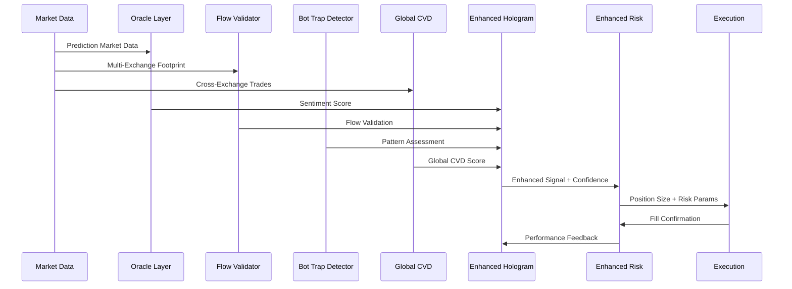

# Design Document: Titan Phase 2 - 2026 Modernization

## Overview

The Titan Phase 2 - 2026 Modernization transforms The Hunter from a 2024-era technical analysis system into a sophisticated institutional-grade trading engine capable of competing with modern AI-driven markets. The design implements four critical enhancement layers that address the evolution of market microstructure, prediction-driven liquidity, and algorithmic manipulation.

**Core Design Philosophy**: "Institutional Awareness Through Multi-Dimensional Analysis"

The enhanced system operates on the principle that successful trading in 2026 requires:
1. **Forward-Looking Intelligence**: Prediction markets reveal institutional positioning before technical patterns form
2. **Global Liquidity Perspective**: Single-exchange analysis is insufficient in fragmented markets
3. **Algorithmic Trap Awareness**: Perfect patterns are often artificial constructs designed to exploit predictable behavior
4. **Institutional Flow Detection**: True institutional activity requires sophisticated footprint analysis beyond simple CVD

**Integration Strategy**: The enhancements are designed as modular layers that augment rather than replace the existing Phase 2 architecture. This ensures backward compatibility while providing progressive enhancement capabilities.

## Architecture

### High-Level System Architecture

```mermaid
graph TB
    subgraph "2026 Enhancement Layer"
        Oracle[Oracle - Prediction Markets]
        FlowValidator[Advanced Flow Validator]
        BotTrap[Bot Trap Detector]
        GlobalCVD[Global Liquidity Aggregator]
    end
    
    subgraph "Enhanced Holographic Engine"
        HologramCore[Hologram Core]
        EnhancedScoring[Enhanced Scoring Engine]
        ConvictionSizing[Conviction-Based Sizing]
    end
    
    subgraph "Classic Phase 2 Core"
        Cartographer[Cartographer - Fractals]
        SessionProfiler[Session Profiler]
        InefficiencyMapper[Inefficiency Mapper]
        CVDValidator[CVD Validator]
    end
    
    subgraph "Data Sources"
        Polymarket[Polymarket API]
        BinanceWS[Binance WebSocket]
        CoinbaseWS[Coinbase WebSocket]
        KrakenWS[Kraken WebSocket]
    end
    
    subgraph "Execution & Risk"
        ExecutionService[Execution Service]
        EnhancedRisk[Enhanced Risk Manager]
        EmergencyProtocols[Emergency Protocols]
    end
    
    Oracle --> Polymarket
    FlowValidator --> BinanceWS
    FlowValidator --> CoinbaseWS
    FlowValidator --> KrakenWS
    GlobalCVD --> BinanceWS
    GlobalCVD --> CoinbaseWS
    GlobalCVD --> KrakenWS
    
    Oracle --> EnhancedScoring
    FlowValidator --> EnhancedScoring
    BotTrap --> EnhancedScoring
    GlobalCVD --> EnhancedScoring
    
    EnhancedScoring --> ConvictionSizing
    ConvictionSizing --> ExecutionService
    
    HologramCore --> Cartographer
    HologramCore --> SessionProfiler
    HologramCore --> InefficiencyMapper
    
    EnhancedScoring --> EnhancedRisk
    EnhancedRisk --> EmergencyProtocols
```



### Component Integration Flow



## Components and Interfaces

### 1. Oracle - Prediction Market Integration

**Purpose**: Provides forward-looking institutional sentiment analysis through prediction market probabilities.

```typescript
interface PredictionMarketEvent {
  id: string;
  title: string;
  probability: number; // 0-100
  volume: number;
  lastUpdate: Date;
  category: 'crypto' | 'macro' | 'regulatory';
  impact: 'low' | 'medium' | 'high';
  timeToResolution: number; // hours
}

interface OracleScore {
  sentiment: number; // -100 to +100
  confidence: number; // 0-100
  events: PredictionMarketEvent[];
  veto: boolean;
  convictionMultiplier: number; // 0.5-2.0
}

class Oracle {
  private polymarketClient: PolymarketClient;
  private eventCache: Map<string, PredictionMarketEvent>;
  private scoreHistory: OracleScore[];
  
  async fetchRelevantEvents(symbol: string): Promise<PredictionMarketEvent[]>
  async calculateSentimentScore(symbol: string, direction: 'long' | 'short'): Promise<OracleScore>
  async shouldVetoSignal(signal: TechnicalSignal, oracleScore: OracleScore): Promise<boolean>
  async getConvictionMultiplier(signal: TechnicalSignal, oracleScore: OracleScore): Promise<number>
  
  private mapSymbolToEvents(symbol: string): string[]
  private weightEventsByImpact(events: PredictionMarketEvent[]): number
  private calculateTimeDecay(event: PredictionMarketEvent): number
}
```

**Key Features**:
- **Event Mapping**: Maps trading symbols to relevant prediction market events
- **Sentiment Calculation**: Converts probabilities to directional sentiment scores
- **Veto Logic**: Prevents trades when prediction markets strongly oppose technical signals
- **Conviction Multipliers**: Increases position sizes when sentiment aligns with technicals
- **Time Decay**: Reduces event impact as resolution approaches

### 2. Advanced Flow Validator - Footprint & Sweep Detection

**Purpose**: Replaces simple CVD with sophisticated institutional flow analysis using intra-candle footprinting.

```typescript
interface FootprintData {
  priceLevel: number;
  bidVolume: number;
  askVolume: number;
  trades: number;
  aggressiveVolume: number;
  passiveVolume: number;
}

interface SweepPattern {
  startPrice: number;
  endPrice: number;
  levelsCleared: number;
  volume: number;
  timestamp: Date;
  direction: 'up' | 'down';
  urgency: 'low' | 'medium' | 'high';
}

interface IcebergAnalysis {
  priceLevel: number;
  initialLiquidity: number;
  refillRate: number; // volume/second
  refillCount: number;
  density: number; // 0-100
  isIceberg: boolean;
}

class AdvancedFlowValidator {
  private footprintCache: Map<string, FootprintData[]>;
  private sweepHistory: SweepPattern[];
  private icebergDetector: IcebergDetector;
  
  async analyzeFootprint(symbol: string, candle: OHLCV): Promise<FootprintData[]>
  async detectSweepPatterns(symbol: string, trades: Trade[]): Promise<SweepPattern[]>
  async analyzeIcebergActivity(symbol: string, priceLevel: number): Promise<IcebergAnalysis>
  async validateInstitutionalFlow(signal: TechnicalSignal): Promise<FlowValidation>
  
  private calculateAggressiveRatio(footprint: FootprintData[]): number
  private identifyPassiveAbsorption(footprint: FootprintData[], priceLevel: number): boolean
  private measureLiquidityRefill(priceLevel: number, timeWindow: number): number
}

interface FlowValidation {
  isValid: boolean;
  confidence: number; // 0-100
  flowType: 'passive_absorption' | 'aggressive_pushing' | 'neutral';
  sweepCount: number;
  icebergDensity: number;
  institutionalProbability: number;
}
```

**Key Features**:
- **Intra-Candle Analysis**: Examines volume distribution within individual candles
- **Sweep Detection**: Identifies aggressive orders clearing multiple price levels
- **Iceberg Detection**: Measures liquidity refill rates to identify hidden orders
- **Flow Classification**: Distinguishes between institutional and retail flow patterns
- **Absorption Analysis**: Detects limit orders soaking up aggressive market orders

### 3. Bot Trap Pattern Recognition

**Purpose**: Identifies artificially perfect patterns created by HFT systems to exploit predictable retail behavior.

```typescript
interface PatternPrecision {
  type: 'equal_highs' | 'equal_lows' | 'fvg' | 'order_block';
  precision: number; // 0-100 (100 = exact tick precision)
  suspicionLevel: 'low' | 'medium' | 'high' | 'extreme';
  characteristics: string[];
}

interface BotTrapAnalysis {
  isSuspect: boolean;
  suspicionScore: number; // 0-100
  patterns: PatternPrecision[];
  recommendations: TrapRecommendation[];
}

interface TrapRecommendation {
  action: 'avoid' | 'reduce_size' | 'require_confirmation' | 'proceed_cautiously';
  reasoning: string;
  adjustments: {
    positionSizeMultiplier: number;
    stopLossAdjustment: number;
    confirmationThreshold: number;
  };
}

class BotTrapDetector {
  private patternHistory: Map<string, PatternPrecision[]>;
  private trapSuccessRate: Map<string, number>;
  private learningEngine: AdaptiveLearning;
  
  async analyzePatternPrecision(pattern: TechnicalPattern): Promise<PatternPrecision>
  async assessTrapProbability(signal: TechnicalSignal): Promise<BotTrapAnalysis>
  async generateRecommendations(analysis: BotTrapAnalysis): Promise<TrapRecommendation[]>
  async updateLearningModel(pattern: TechnicalPattern, outcome: TradeOutcome): Promise<void>
  
  private calculatePrecisionScore(levels: number[]): number
  private identifyArtificialCharacteristics(pattern: TechnicalPattern): string[]
  private assessTimingPerfection(pattern: TechnicalPattern): number
}
```

**Key Features**:
- **Precision Analysis**: Measures exact tick-level precision in patterns
- **Artificial Characteristics**: Identifies patterns that are "too perfect" to be natural
- **Adaptive Learning**: Improves detection accuracy based on historical outcomes
- **Risk Adjustments**: Modifies position sizing and confirmation requirements for suspect patterns
- **Pattern Classification**: Categorizes different types of potential traps

### 4. Global Liquidity Aggregator

**Purpose**: Combines order flow from multiple exchanges to provide a comprehensive view of institutional activity.

```typescript
interface ExchangeFlow {
  exchange: 'binance' | 'coinbase' | 'kraken';
  cvd: number;
  volume: number;
  trades: number;
  weight: number; // 0-1 based on volume
  timestamp: Date;
  status: 'connected' | 'disconnected' | 'delayed';
}

interface GlobalCVDData {
  aggregatedCVD: number;
  exchangeFlows: ExchangeFlow[];
  consensus: 'bullish' | 'bearish' | 'neutral' | 'conflicted';
  confidence: number; // 0-100
  manipulation: ManipulationAnalysis;
}

interface ManipulationAnalysis {
  detected: boolean;
  suspectExchange: string | null;
  divergenceScore: number; // 0-100
  pattern: 'single_exchange_outlier' | 'coordinated_manipulation' | 'none';
}

class GlobalLiquidityAggregator {
  private exchangeConnections: Map<string, WebSocketConnection>;
  private flowHistory: Map<string, ExchangeFlow[]>;
  private weightingEngine: VolumeWeightingEngine;
  
  async aggregateGlobalCVD(symbol: string): Promise<GlobalCVDData>
  async detectCrossExchangeManipulation(symbol: string): Promise<ManipulationAnalysis>
  async calculateExchangeWeights(symbol: string): Promise<Map<string, number>>
  async validateSignalConsensus(signal: TechnicalSignal): Promise<boolean>
  
  private normalizeExchangeData(flows: ExchangeFlow[]): ExchangeFlow[]
  private calculateVolumeWeights(flows: ExchangeFlow[]): Map<string, number>
  private identifyOutliers(flows: ExchangeFlow[]): string[]
}
```

**Key Features**:
- **Multi-Exchange Integration**: Connects to Binance, Coinbase, and Kraken simultaneously
- **Volume-Weighted Aggregation**: Weights each exchange's contribution by trading volume
- **Manipulation Detection**: Identifies single-exchange outliers and coordinated manipulation
- **Consensus Building**: Requires majority agreement across exchanges for signal validation
- **Failover Handling**: Continues operation when individual exchanges go offline

### 5. Enhanced Holographic Engine

**Purpose**: Integrates all enhancement layers with the existing Phase 2 holographic state machine.

```typescript
interface EnhancedHolographicState {
  // Classic Phase 2 components
  dailyBias: TrendDirection;
  fourHourLocation: 'premium' | 'discount' | 'equilibrium';
  fifteenMinuteTrigger: MarketStructure;
  
  // 2026 enhancements
  oracleScore: OracleScore;
  flowValidation: FlowValidation;
  botTrapAnalysis: BotTrapAnalysis;
  globalCVD: GlobalCVDData;
  
  // Enhanced scoring
  enhancedScore: number; // 0-100
  convictionLevel: 'low' | 'medium' | 'high' | 'extreme';
  alignment: 'A+' | 'A' | 'B' | 'C' | 'VETO';
}

interface ConvictionSizing {
  baseSize: number;
  oracleMultiplier: number;
  flowMultiplier: number;
  trapReduction: number;
  globalCVDMultiplier: number;
  finalSize: number;
  reasoning: string[];
}

class EnhancedHolographicEngine {
  private oracle: Oracle;
  private flowValidator: AdvancedFlowValidator;
  private botTrapDetector: BotTrapDetector;
  private globalAggregator: GlobalLiquidityAggregator;
  
  async calculateEnhancedState(symbol: string): Promise<EnhancedHolographicState>
  async determineConvictionSizing(signal: TechnicalSignal, state: EnhancedHolographicState): Promise<ConvictionSizing>
  async validateEnhancedSignal(signal: TechnicalSignal): Promise<boolean>
  
  private combineEnhancementScores(state: EnhancedHolographicState): number
  private resolveConflictingSignals(state: EnhancedHolographicState): 'proceed' | 'veto' | 'reduce'
  private calculateFinalAlignment(state: EnhancedHolographicState): string
}
```

**Key Features**:
- **Layered Integration**: Combines all enhancement layers with classic Phase 2 logic
- **Enhanced Scoring**: Uses weighted combination of all analysis components
- **Conviction-Based Sizing**: Adjusts position sizes based on multi-dimensional confidence
- **Conflict Resolution**: Handles disagreements between different analysis layers
- **Backward Compatibility**: Maintains classic Phase 2 functionality as fallback

## Data Models

### Core Enhancement Data Structures

```typescript
// Prediction Market Integration
interface PredictionEvent {
  id: string;
  title: string;
  description: string;
  probability: number;
  volume: number;
  liquidity: number;
  category: EventCategory;
  impact: ImpactLevel;
  resolution: Date;
  lastUpdate: Date;
  source: 'polymarket' | 'augur' | 'gnosis';
}

enum EventCategory {
  CRYPTO_PRICE = 'crypto_price',
  FED_POLICY = 'fed_policy',
  REGULATORY = 'regulatory',
  MACRO_ECONOMIC = 'macro_economic',
  GEOPOLITICAL = 'geopolitical'
}

enum ImpactLevel {
  LOW = 'low',
  MEDIUM = 'medium',
  HIGH = 'high',
  EXTREME = 'extreme'
}

// Advanced Flow Analysis
interface TradeFootprint {
  timestamp: Date;
  price: number;
  volume: number;
  side: 'buy' | 'sell';
  aggressor: 'buyer' | 'seller';
  orderType: 'market' | 'limit';
  exchange: string;
}

interface LiquidityLevel {
  price: number;
  bidSize: number;
  askSize: number;
  bidOrders: number;
  askOrders: number;
  timestamp: Date;
  exchange: string;
}

// Bot Trap Detection
interface PatternCharacteristics {
  precision: number; // 0-100
  timing: number; // 0-100 (100 = perfect timing)
  volume: number; // relative volume during pattern formation
  complexity: number; // pattern complexity score
  frequency: number; // how often this pattern appears
}

interface TrapIndicators {
  exactTickPrecision: boolean;
  perfectTiming: boolean;
  unusualVolume: boolean;
  textbookPattern: boolean;
  suspiciousFrequency: boolean;
}

// Global Liquidity
interface ExchangeMetrics {
  exchange: string;
  volume24h: number;
  marketShare: number;
  latency: number;
  reliability: number;
  lastUpdate: Date;
  status: ConnectionStatus;
}

enum ConnectionStatus {
  CONNECTED = 'connected',
  DISCONNECTED = 'disconnected',
  RECONNECTING = 'reconnecting',
  DELAYED = 'delayed',
  ERROR = 'error'
}
```

### Enhanced Configuration Schema

```typescript
interface EnhancedConfiguration {
  oracle: {
    enabled: boolean;
    polymarketApiKey: string;
    vetoThreshold: number; // 30-70
    convictionMultiplierMax: number; // 1.0-2.0
    eventCategories: EventCategory[];
    updateInterval: number; // seconds
  };
  
  flowValidator: {
    enabled: boolean;
    sweepThreshold: number; // 3-10 levels
    icebergDensityThreshold: number; // 0-100
    footprintAnalysisDepth: number; // price levels
    institutionalThreshold: number; // 0-100
  };
  
  botTrapDetector: {
    enabled: boolean;
    precisionThreshold: number; // 0.1-1.0%
    suspicionThreshold: number; // 0-100
    learningEnabled: boolean;
    adaptiveAdjustments: boolean;
  };
  
  globalAggregator: {
    enabled: boolean;
    exchanges: string[];
    weightingMethod: 'volume' | 'liquidity' | 'hybrid';
    consensusThreshold: number; // 0.5-1.0
    manipulationSensitivity: number; // 0-100
  };
  
  riskManagement: {
    maxConvictionMultiplier: number;
    emergencyProtocols: boolean;
    predictionEventRiskReduction: number;
    multiExchangeFailureProtocol: string;
  };
}
```

## Error Handling

### Enhanced Error Categories

```typescript
enum EnhancedErrorType {
  // Oracle Errors
  ORACLE_CONNECTION_FAILED = 'oracle_connection_failed',
  PREDICTION_DATA_STALE = 'prediction_data_stale',
  ORACLE_API_RATE_LIMIT = 'oracle_api_rate_limit',
  
  // Flow Validator Errors
  FOOTPRINT_ANALYSIS_FAILED = 'footprint_analysis_failed',
  SWEEP_DETECTION_ERROR = 'sweep_detection_error',
  ICEBERG_ANALYSIS_TIMEOUT = 'iceberg_analysis_timeout',
  
  // Bot Trap Errors
  PATTERN_ANALYSIS_FAILED = 'pattern_analysis_failed',
  LEARNING_MODEL_ERROR = 'learning_model_error',
  TRAP_DETECTION_TIMEOUT = 'trap_detection_timeout',
  
  // Global Aggregator Errors
  EXCHANGE_CONNECTION_LOST = 'exchange_connection_lost',
  CVD_AGGREGATION_FAILED = 'cvd_aggregation_failed',
  MANIPULATION_DETECTION_ERROR = 'manipulation_detection_error',
  
  // System Integration Errors
  ENHANCEMENT_LAYER_CONFLICT = 'enhancement_layer_conflict',
  FALLBACK_MODE_ACTIVATED = 'fallback_mode_activated',
  EMERGENCY_PROTOCOL_TRIGGERED = 'emergency_protocol_triggered'
}

class EnhancedErrorHandler {
  async handleOracleError(error: OracleError): Promise<void> {
    switch (error.type) {
      case EnhancedErrorType.ORACLE_CONNECTION_FAILED:
        await this.activateFallbackMode('oracle');
        break;
      case EnhancedErrorType.PREDICTION_DATA_STALE:
        await this.useLastKnownGoodData('oracle');
        break;
      case EnhancedErrorType.ORACLE_API_RATE_LIMIT:
        await this.implementBackoffStrategy('oracle');
        break;
    }
  }
  
  async handleFlowValidatorError(error: FlowValidatorError): Promise<void> {
    // Fallback to classic CVD analysis
    await this.activateClassicCVD();
    this.logError(error, 'flow_validator');
  }
  
  async handleGlobalAggregatorError(error: GlobalAggregatorError): Promise<void> {
    // Continue with available exchanges
    await this.reconfigureExchangeWeights();
    this.logError(error, 'global_aggregator');
  }
  
  private async activateFallbackMode(component: string): Promise<void>
  private async useLastKnownGoodData(component: string): Promise<void>
  private async implementBackoffStrategy(component: string): Promise<void>
}
```

### Graceful Degradation Strategy

```typescript
interface DegradationLevel {
  level: 'none' | 'partial' | 'significant' | 'emergency';
  affectedComponents: string[];
  fallbackStrategy: string;
  performanceImpact: number; // 0-100%
}

class GracefulDegradationManager {
  async assessSystemHealth(): Promise<DegradationLevel> {
    const componentHealth = await this.checkAllComponents();
    return this.calculateDegradationLevel(componentHealth);
  }
  
  async implementDegradation(level: DegradationLevel): Promise<void> {
    switch (level.level) {
      case 'partial':
        await this.disableNonCriticalEnhancements();
        break;
      case 'significant':
        await this.fallbackToClassicPhase2();
        break;
      case 'emergency':
        await this.activateEmergencyProtocols();
        break;
    }
  }
  
  private async disableNonCriticalEnhancements(): Promise<void>
  private async fallbackToClassicPhase2(): Promise<void>
  private async activateEmergencyProtocols(): Promise<void>
}
```

## Testing Strategy

### Comprehensive Testing Approach

The 2026 modernization requires extensive testing across multiple dimensions:

#### 1. Unit Testing Strategy

**Oracle Component Testing**:
```typescript
describe('Oracle - Prediction Market Integration', () => {
  test('should fetch relevant prediction events for BTC', async () => {
    const oracle = new Oracle(mockPolymarketClient);
    const events = await oracle.fetchRelevantEvents('BTCUSDT');
    expect(events).toHaveLength(greaterThan(0));
    expect(events[0]).toHaveProperty('probability');
  });
  
  test('should calculate sentiment score correctly', async () => {
    const oracle = new Oracle(mockPolymarketClient);
    const score = await oracle.calculateSentimentScore('BTCUSDT', 'long');
    expect(score.sentiment).toBeBetween(-100, 100);
    expect(score.confidence).toBeBetween(0, 100);
  });
});
```

**Flow Validator Testing**:
```typescript
describe('Advanced Flow Validator', () => {
  test('should detect sweep patterns correctly', async () => {
    const validator = new AdvancedFlowValidator();
    const trades = generateMockSweepTrades();
    const sweeps = await validator.detectSweepPatterns('BTCUSDT', trades);
    expect(sweeps).toHaveLength(1);
    expect(sweeps[0].levelsCleared).toBeGreaterThan(5);
  });
  
  test('should identify iceberg orders', async () => {
    const validator = new AdvancedFlowValidator();
    const analysis = await validator.analyzeIcebergActivity('BTCUSDT', 50000);
    expect(analysis.isIceberg).toBe(true);
    expect(analysis.density).toBeGreaterThan(70);
  });
});
```

#### 2. Property-Based Testing

Before writing the correctness properties, I need to analyze the acceptance criteria for testability:

#### Property-Based Testing

*A property is a characteristic or behavior that should hold true across all valid executions of a system-essentially, a formal statement about what the system should do. Properties serve as the bridge between human-readable specifications and machine-verifiable correctness guarantees.*

Based on the prework analysis, the following correctness properties must be validated:

**Property 1: Oracle Score Bounds**
*For any* set of prediction market events, the calculated Oracle sentiment score should always be between -100 and +100 inclusive
**Validates: Requirements 1.2**

**Property 2: Conviction Multiplier Application**
*For any* Oracle Score above +60 with Bullish technical signal, the system should apply exactly 1.5x Conviction Multiplier to position size
**Validates: Requirements 1.3, 1.4**

**Property 3: Prediction Veto Logic**
*For any* Oracle Score that conflicts with technical signal by more than 40 points, the system should veto the signal and log PREDICTION_VETO
**Validates: Requirements 1.5**

**Property 4: BTC Crash Veto**
*For any* "BTC Crash" probability exceeding 40%, all Long A+ setups should be vetoed regardless of technical alignment
**Validates: Requirements 1.6**

**Property 5: Sweep Pattern Detection**
*For any* sequence of trades where a single aggressive order clears 5 or more price levels, the system should identify it as a Sweep Pattern
**Validates: Requirements 2.2**

**Property 6: Iceberg Density Measurement**
*For any* order book data at an Order Block, the system should consistently measure and report Iceberg Density based on liquidity refill rates
**Validates: Requirements 2.3**

**Property 7: Flow Classification Consistency**
*For any* CVD data, the system should consistently distinguish between Passive Absorption (bullish) and Aggressive Pushing (bearish)
**Validates: Requirements 2.6**

**Property 8: Bot Trap Precision Detection**
*For any* price pattern with exact tick precision, the system should flag it as SUSPECT_TRAP
**Validates: Requirements 3.1, 3.2**

**Property 9: Suspect Trap Risk Adjustment**
*For any* pattern flagged as SUSPECT_TRAP, the system should reduce position size by exactly 50% and tighten stop loss to 1%
**Validates: Requirements 3.5**

**Property 10: Global CVD Aggregation**
*For any* volume data from Binance, Coinbase, and Kraken, the Global CVD calculation should use volume-weighted averaging
**Validates: Requirements 4.2**

**Property 11: Cross-Exchange Consensus**
*For any* Global CVD signal confirmation, minimum 2 out of 3 exchanges must show the same flow direction
**Validates: Requirements 4.4**

**Property 12: Enhanced Holographic Scoring Formula**
*For any* valid inputs, Enhanced Holographic Score should equal Daily_Bias × 0.4 + 4H_Location × 0.25 + 15m_Flow × 0.15 + Oracle_Score × 0.2
**Validates: Requirements 5.1**

**Property 13: Position Size Multiplier Capping**
*For any* combination of enhancement factors, the total position size multiplier should never exceed 2.0x
**Validates: Requirements 7.5**

**Property 14: Conservative Multiplier Selection**
*For any* conflicting enhancement factors, the system should always use the most conservative multiplier
**Validates: Requirements 7.6**

**Property 15: High-Impact Event Risk Reduction**
*For any* event with probability exceeding 70%, all position sizes should be reduced by exactly 50%
**Validates: Requirements 8.1**

**Property 16: Probability Threshold Detection**
*For any* event probability crossing the 50% threshold, the system should emit a PROBABILITY_FLIP alert
**Validates: Requirements 10.2**

**Property 17: Price Spread Calculation**
*For any* price data from Binance, Coinbase, and Kraken, the system should accurately calculate the price spread between exchanges
**Validates: Requirements 11.1**

**Property 18: Arbitrage Opportunity Detection**
*For any* price spread exceeding 0.5%, the system should flag it as ARBITRAGE_OPPORTUNITY
**Validates: Requirements 11.2**

**Property 19: Emergency Protocol Activation**
*For any* prediction market showing extreme event probability above 90%, the system should trigger PREDICTION_EMERGENCY and flatten all positions
**Validates: Requirements 14.1**

**Property 20: Configuration Parameter Validation**
*For any* configuration parameter, the system should enforce valid ranges (e.g., Prediction Veto threshold between 30-70%)
**Validates: Requirements 16.1, 16.2, 16.3, 16.4, 16.5**

#### Integration Testing Strategy

**Multi-Exchange Integration Tests**:
```typescript
describe('Global Liquidity Integration', () => {
  test('should handle exchange disconnections gracefully', async () => {
    const aggregator = new GlobalLiquidityAggregator();
    await aggregator.simulateExchangeFailure('binance');
    const globalCVD = await aggregator.aggregateGlobalCVD('BTCUSDT');
    expect(globalCVD.exchangeFlows).toHaveLength(2); // Coinbase + Kraken
    expect(globalCVD.consensus).toBeDefined();
  });
  
  test('should detect cross-exchange manipulation', async () => {
    const aggregator = new GlobalLiquidityAggregator();
    const manipulationData = generateManipulationScenario();
    const analysis = await aggregator.detectCrossExchangeManipulation('BTCUSDT');
    expect(analysis.detected).toBe(true);
    expect(analysis.suspectExchange).toBe('binance');
  });
});
```

**Oracle Integration Tests**:
```typescript
describe('Prediction Market Integration', () => {
  test('should handle Polymarket API failures', async () => {
    const oracle = new Oracle(failingPolymarketClient);
    const score = await oracle.calculateSentimentScore('BTCUSDT', 'long');
    expect(score.confidence).toBe(0); // Should fallback gracefully
    expect(score.veto).toBe(false); // Should not veto on API failure
  });
  
  test('should integrate with existing Phase 2 hologram', async () => {
    const enhancedHologram = new EnhancedHolographicEngine();
    const state = await enhancedHologram.calculateEnhancedState('BTCUSDT');
    expect(state.dailyBias).toBeDefined(); // Classic Phase 2 data
    expect(state.oracleScore).toBeDefined(); // 2026 enhancement data
    expect(state.enhancedScore).toBeBetween(0, 100);
  });
});
```

#### Performance Testing

**Latency Requirements**:
- Oracle score calculation: < 500ms
- Global CVD aggregation: < 200ms
- Bot trap detection: < 100ms
- Enhanced holographic state: < 1000ms

**Throughput Requirements**:
- Handle 1000+ prediction market events simultaneously
- Process 10,000+ trades/second for footprint analysis
- Support 100+ symbols for bot trap detection
- Aggregate data from 3 exchanges with 99.9% uptime

#### Load Testing Strategy

```typescript
describe('Performance Load Tests', () => {
  test('should handle high-frequency prediction market updates', async () => {
    const oracle = new Oracle(mockPolymarketClient);
    const startTime = Date.now();
    
    const promises = Array.from({ length: 1000 }, () =>
      oracle.calculateSentimentScore('BTCUSDT', 'long')
    );
    
    await Promise.all(promises);
    const duration = Date.now() - startTime;
    expect(duration).toBeLessThan(5000); // 5 seconds for 1000 calculations
  });
  
  test('should maintain performance under multi-exchange load', async () => {
    const aggregator = new GlobalLiquidityAggregator();
    const startTime = Date.now();
    
    // Simulate high-frequency trade data from all exchanges
    const tradeStream = generateHighFrequencyTrades(10000);
    await aggregator.processTradeStream(tradeStream);
    
    const duration = Date.now() - startTime;
    expect(duration).toBeLessThan(2000); // 2 seconds for 10k trades
  });
});
```

### Testing Configuration

**Property-Based Test Configuration**:
- Minimum 100 iterations per property test
- Use fast-check library for TypeScript property generation
- Tag format: **Feature: titan-phase2-2026-modernization, Property {number}: {property_text}**

**Test Data Generation**:
```typescript
// Property test generators
const arbitraryPredictionEvent = fc.record({
  probability: fc.float({ min: 0, max: 100 }),
  volume: fc.float({ min: 0, max: 1000000 }),
  impact: fc.constantFrom('low', 'medium', 'high'),
  category: fc.constantFrom('crypto', 'macro', 'regulatory')
});

const arbitraryTradeData = fc.record({
  price: fc.float({ min: 1000, max: 100000 }),
  volume: fc.float({ min: 0.001, max: 100 }),
  side: fc.constantFrom('buy', 'sell'),
  timestamp: fc.date()
});

const arbitraryExchangeData = fc.record({
  exchange: fc.constantFrom('binance', 'coinbase', 'kraken'),
  cvd: fc.float({ min: -1000000, max: 1000000 }),
  volume: fc.float({ min: 0, max: 1000000 }),
  status: fc.constantFrom('connected', 'disconnected', 'delayed')
});
```

## Implementation Phases

### Phase 1: Foundation Layer (Weeks 1-2)
1. **Oracle Infrastructure**: Implement Polymarket API client and basic sentiment calculation
2. **Global Aggregator Setup**: Establish multi-exchange WebSocket connections
3. **Enhanced Configuration**: Extend existing config system for 2026 parameters
4. **Basic Integration**: Connect enhancement layers to existing Phase 2 core

### Phase 2: Core Enhancement Logic (Weeks 3-4)
1. **Advanced Flow Validator**: Implement footprint analysis and sweep detection
2. **Bot Trap Detector**: Build pattern precision analysis and trap identification
3. **Enhanced Holographic Engine**: Integrate all layers with existing hologram logic
4. **Conviction-Based Sizing**: Implement multi-factor position sizing

### Phase 3: Risk & Emergency Systems (Weeks 5-6)
1. **Enhanced Risk Management**: Implement prediction-aware risk protocols
2. **Emergency Protocols**: Build multi-layer emergency response system
3. **Graceful Degradation**: Implement fallback mechanisms for component failures
4. **Performance Optimization**: Optimize for latency and throughput requirements

### Phase 4: Analytics & Learning (Weeks 7-8)
1. **Performance Analytics**: Build comprehensive enhancement effectiveness tracking
2. **Adaptive Learning**: Implement bot trap learning algorithms
3. **Enhanced HUD**: Upgrade user interface with 2026 enhancement displays
4. **Backtesting Integration**: Extend backtesting with historical enhancement data

### Phase 5: Testing & Validation (Weeks 9-10)
1. **Comprehensive Testing**: Execute all unit, property, and integration tests
2. **Performance Validation**: Validate latency and throughput requirements
3. **Historical Backtesting**: Run enhanced system against 2024-2025 market data
4. **Production Readiness**: Final optimization and deployment preparation

## Deployment Strategy

### Gradual Rollout Approach

**Stage 1: Shadow Mode (Week 11)**
- Run 2026 enhancements in parallel with classic Phase 2
- Log all enhancement decisions without affecting actual trading
- Compare enhancement recommendations with classic system
- Validate performance and accuracy metrics

**Stage 2: Partial Integration (Week 12)**
- Enable Oracle integration with 50% weight in holographic scoring
- Activate Global CVD with fallback to single-exchange CVD
- Enable Bot Trap detection with warnings only (no position adjustments)
- Monitor system stability and performance

**Stage 3: Full Enhancement (Week 13)**
- Enable all 2026 enhancements with full weights
- Activate conviction-based position sizing
- Enable all emergency protocols
- Begin live trading with enhanced system

**Stage 4: Optimization (Week 14)**
- Analyze live performance data
- Optimize parameters based on real market conditions
- Fine-tune adaptive learning algorithms
- Document lessons learned and best practices

### Rollback Strategy

**Immediate Rollback Triggers**:
- System performance degradation > 20%
- Enhancement accuracy < 60%
- Critical component failure rate > 5%
- User-reported issues > 10 per day

**Rollback Process**:
1. **Automatic Fallback**: System automatically reverts to classic Phase 2 on critical failures
2. **Manual Override**: User can disable enhancements via configuration
3. **Gradual Rollback**: Disable enhancements one layer at a time to isolate issues
4. **Emergency Stop**: Complete system shutdown with position flattening if necessary

### Monitoring & Alerting

**Key Metrics to Monitor**:
- Enhancement layer uptime and performance
- Prediction market data freshness and accuracy
- Multi-exchange connection stability
- Bot trap detection accuracy and false positive rate
- Overall system performance vs classic Phase 2

**Alert Thresholds**:
- Oracle connection failure > 30 seconds
- Exchange disconnection > 2 exchanges simultaneously
- Bot trap false positive rate > 20%
- System latency > 2x baseline
- Enhancement effectiveness < 80% of expected

This comprehensive design provides a robust foundation for implementing the 2026 modernization while maintaining the reliability and performance of the existing Phase 2 system. The modular architecture ensures that enhancements can be developed, tested, and deployed incrementally while providing fallback mechanisms for operational safety.