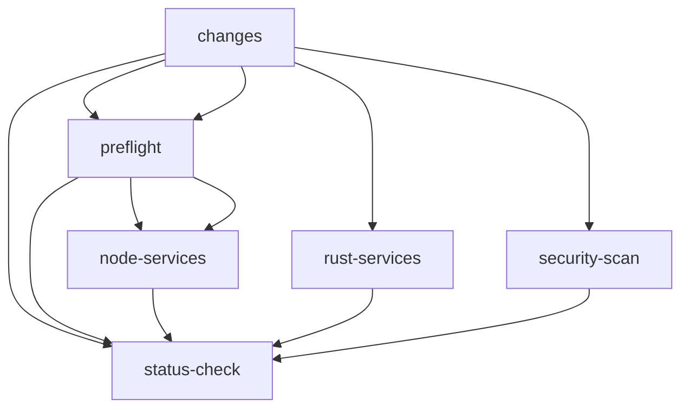
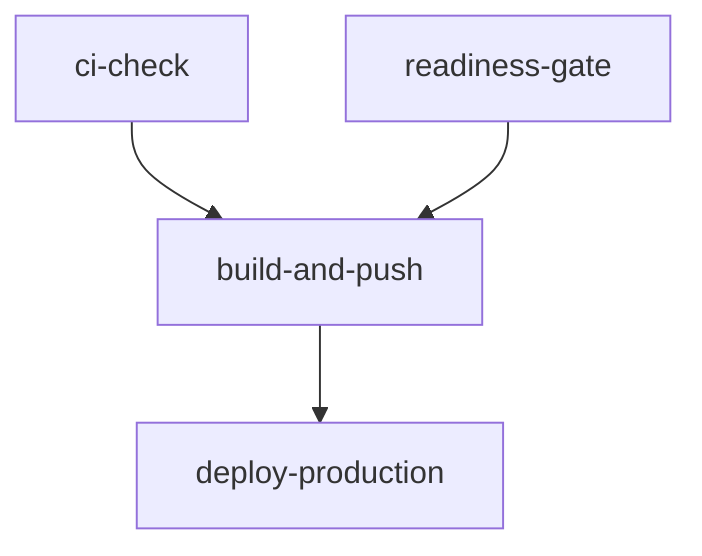

# Workflow Inventory - Titan Trading System

## Summary

| Workflow | File | Triggers | Purpose | Critical Path |
|----------|------|----------|---------|---------------|
| Titan Monorepo CI | ci.yml | push, pull_request, merge_group, schedule, manual | Main CI pipeline | YES |
| Deploy to Production | deploy-prod.yml | workflow_run (after CI), manual | Production deployment | YES |
| AI Doc Regeneration | ai-doc-regen.yml | push (code paths), manual | AI-driven doc updates | NO |
| Autophagy | autophagy.yml | schedule (daily), manual | Dead code scanning (knip) | NO |
| Nightly Chaos | chaos.yml | schedule (nightly), manual | Chaos engineering tests | NO |
| Deploy Docs | deploy_docs.yml | ? | Documentation deployment | NO |

---

## Titan Monorepo CI (ci.yml)

**Lines:** 531
**Concurrency:** `ci-${{ github.workflow }}-${{ github.event.pull_request.number || github.ref }}` cancel-in-progress: true

### Environment Variables
- NODE_VERSION: '22.19.0'
- NPM_VERSION: '11.6.2'  
- RUST_VERSION: '1.89.0'

### Jobs Graph

### Job Details

#### 1. changes
- **Purpose:** Detect changed scopes for path-based execution
- **Outputs:** docs_only, run_node, run_rust, run_security, run_contracts, run_hygiene
- **Runtime:** ~10s

#### 2. preflight
- **Depends on:** changes
- **Skip condition:** schedule events
- **Steps:**
  - Checkout, Setup Node.js, Pin npm
  - Install dependencies (npm ci)
  - Validate configuration
  - Validate environment variables
  - Check Contract Drift (scripts/ci/check_contracts.sh)
  - SOTA Hygiene Checks (zombie, circular, immutability)
  - Verify Documentation Invariants
  - Documentation Staleness Detection (soft-fail)
  - Documentation Link Validation (soft-fail)
  - API-to-OpenAPI Sync Check (soft-fail)
  - **Code Block Validation** ← CURRENT FAILURE POINT
  - Signature Drift Detection
  - Check Dead Code (knip)
- **Runtime:** ~3-5 min

#### 3. node-services
- **Depends on:** changes, preflight
- **Skip condition:** schedule, docs_only, run_node=false
- **Steps:**
  - Checkout, Setup Node.js, Pin npm
  - Restore Turbo cache
  - Install dependencies
  - Start NATS (Docker)
  - Turbo Build & Test (affected filter for PRs)
- **Runtime:** ~3-6 min

#### 4. rust-services (titan-execution-rs)
- **Depends on:** changes
- **Skip condition:** schedule, run_rust=false
- **Steps:**
  - Checkout, Setup Rust
  - Rust Cache
  - cargo fmt --check
  - cargo clippy
  - Start NATS (Docker)
  - cargo test
  - cargo build --release
- **Runtime:** ~3-5 min (cached)

#### 5. security-scan
- **Depends on:** changes
- **Skip condition:** schedule, run_security=false
- **Steps:**
  - Checkout, Setup Node.js + Rust
  - Cache cargo-audit
  - npm ci
  - npm audit --audit-level=high
  - cargo audit
- **Runtime:** ~2-3 min

#### 6. nightly-security
- **Condition:** schedule event only
- **Steps:** Full audits + SBOM generation

#### 7. status-check (CI Pipeline Status)
- **Depends on:** ALL jobs
- **Purpose:** Aggregate gate
- **Check condition:** Fail if any required job failed/cancelled

### Caches Used
- actions/setup-node cache (npm)
- .turbo directory cache
- swatinem/rust-cache
- cargo-audit binary cache

### Scripts Invoked
- scripts/ci/check_contracts.sh
- scripts/verify-docs.sh
- scripts/docs/detect-staleness.sh
- scripts/docs/check-links.sh
- scripts/docs/check-api-sync.sh
- scripts/docs/validate-codeblocks.sh
- scripts/docs/detect-signature-drift.sh

---

## Deploy to Production (deploy-prod.yml)

**Lines:** 269
**Concurrency:** `production_deploy` cancel-in-progress: false

### Job Graph

### Jobs

#### 1. ci-check
- **Trigger condition:** workflow_run success OR manual with skip_ci_check
- **Purpose:** Gate on CI passing

#### 2. readiness-gate
- **Purpose:** Run gatekeeper script
- **Script:** `npm exec --yes --package=tsx -- tsx scripts/ci/gatekeeper.ts`

#### 3. build-and-push
- **Permissions:** contents: read, packages: write
- **Matrix:** 8 services (titan-brain, titan-execution-rs, titan-console, etc.)
- **Steps:**
  - Docker Buildx setup
  - GHCR login
  - Build and push with GHA cache
  - Export digest artifacts

#### 4. deploy-production
- **Environment:** production (protected)
- **Steps:**
  - Download digests
  - Sign release manifest
  - Prepare deployment package
  - SCP to droplet
  - Execute atomic deploy script

### Security Notes
- Uses secrets: PROD_SSH_HOST, PROD_SSH_USER, PROD_SSH_KEY, TITAN_RELEASE_KEY
- Uses third-party actions: appleboy/scp-action, appleboy/ssh-action (NOT SHA pinned)

---

## AI Doc Regeneration (ai-doc-regen.yml)

**Lines:** 132
**Permissions:** contents: write, issues: write, pull-requests: write

### Path Triggers
- services/**/*.rs
- packages/**/*.ts
- apps/**/*.ts
- config/**
- docker-compose*.yml

### Jobs
1. analyze-docs - Run AI analyzer
2. create-issue - Create/update GitHub issue

---

## Autophagy (autophagy.yml)

**Lines:** 67
**Schedule:** Daily at midnight
**Purpose:** Dead code detection via knip

---

## Chaos (chaos.yml)

**Lines:** 55
**Schedule:** Daily at 2 AM
**Purpose:** Chaos engineering tests
**Note:** Requires NATS_SYS_PASSWORD secret - gracefully skips if unavailable

---

## Actions Audit

### Actions Used (Not SHA Pinned - SECURITY RISK)
- actions/checkout@v5
- actions/setup-node@v4
- actions/cache@v4
- actions/upload-artifact@v4
- actions/download-artifact@v4
- docker/setup-buildx-action@v3
- docker/login-action@v3
- docker/metadata-action@v5
- docker/build-push-action@v5
- dtolnay/rust-toolchain@master
- swatinem/rust-cache@v2
- anchore/sbom-action@v0
- appleboy/scp-action@v0.1.7
- appleboy/ssh-action@v1.0.3

### Permissions Summary

| Workflow | Default | Job-specific |
|----------|---------|--------------|
| ci.yml | (not set - defaults to read) | None |
| deploy-prod.yml | (not set) | packages: write |
| ai-doc-regen.yml | contents/issues/pull-requests: write | None |

