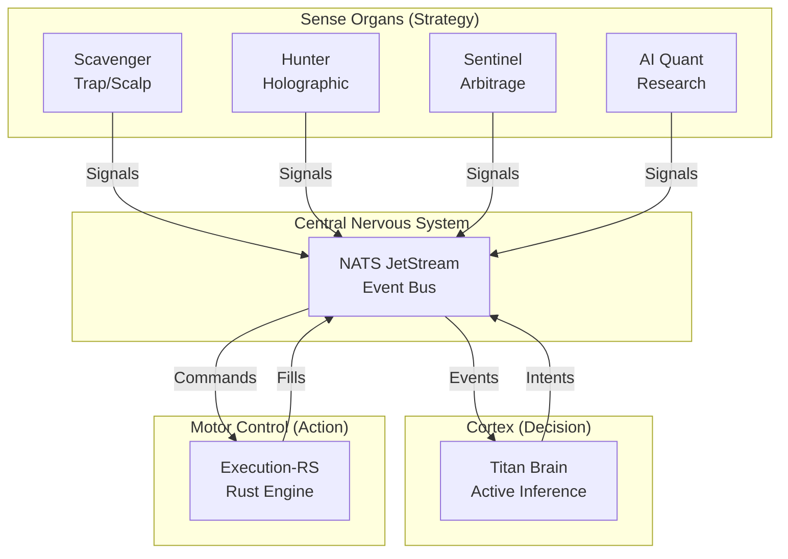

# Architecture: The Titan Organism

> **Context**: High-Level System Design
> **See Also**: [Knowledge Graph](knowledge-graph.md), [Source of Truth](system-source-of-truth.md)
> **Status**: Canonical
> **Authority**: Titan Lead Architect
> **Model**: Bio-Mimetic Active Inference

## 1. High Level Concept

Titan is not a "bot"; it is an autonomous **Trading Organism**. It is designed around the principles of **Active Inference** (Free Energy Principle), where the system constantly models external reality (markets) and acts to minimize the divergence between its model and its goals (profit, survival).

The system is composed of specialized organs (services) that communicate via a central nervous system (NATS JetStream).

### 1.1 The Prime Directive: Survival

Unlike traditional algos that maximize PnL, Titan maximizes **Survival** (Capital Preservation) first, and PnL second.

- **Risk First**: If the "Truth Layer" (reconciliation) degrades, the organism freezes.
- **Fail-Closed**: Missing signals or broken contracts result in a safe halting state.

## 2. Anatomy (Topology)

### 2.1 The Organs

#### **Titan Brain (The Cortex)**

- **Stack**: TypeScript, Active Inference.
- **Role**: State aggregation, Allocation, High-Level Decision Making.
- **Behavior**: It listens to all signals, updates its internal "Belief State" (Market Regime, Volatility), and decides *if* and *how much* capital to allocate to a strategy's intent. It acts as the "Risk Governor".

#### **Execution-RS (Motor Control)**

- **Stack**: Rust, Actix, Redb.
- **Role**: Low-latency execution, position management, exchange connectivity.
- **Behavior**: It is "dumb" but fast and safe. It executes commands signed by the Brain. It maintains the "Shadow State" (local truth) and reconciles it with the Exchange. It houses the **Circuit Breakers**.

#### **Strategies (The Senses)**

- **Phase 1: Scavenger**: High-frequency, low-capital "Trap" system. Detects short-term inefficiencies.
- **Phase 2: Hunter**: Holographic market structure analysis. Detects medium-term trends.
- **Phase 3: Sentinel**: Delta-neutral arbitrage. Low risk, steady yield.
- **AI Quant**: Offline (and near-realtime) optimization engine using Gemini 2.0 Flash to evolve parameters.

## 3. The Nervous System (NATS JetStream)

Communication is asynchronous and event-driven, but strictly typed.

- **Commands (`titan.cmd.>`):** Directives to do something.
  - `titan.cmd.execution.place.v1`: Place an order.
  - `titan.cmd.sys.halt.v1`: HALT trading.
- **Events (`titan.evt.>`):** Facts that occurred.
  - `titan.evt.execution.fill.v1`: An order was filled.
  - `titan.evt.scavenger.signal.v1`: A strategy saw something.
- **Data (`titan.data.>`):** Ephemeral telemetry (tickers, metrics).

**Invariant**: The stream is the "Journal of Record". Only if an event is persisted in JetStream did it "happen".

## 4. The Loop (How it Trades)

1. **Sensing**: A Strategy (e.g., Hunter) detects a pattern. It publishes a `Signal` (Event) via NATS.
2. **Perception**: Brain consumes the `Signal`. It checks:
    - Is the signal valid?
    - Does this align with the current Regime (e.g., "Bullish Trend")?
    - Do we have budget?
3. **Action Selection**: Brain generates a `Trade Intent`. It signs it with `HMAC_SECRET`.
4. **Transmission**: The Intent is published as a `Command` to Execution.
5. **Validation**: Execution-RS receives the Command. It verifies:
    - Signature (Security).
    - Risk Limits (Policy).
    - Circuit Breaker State.
6. **Actuation**: Execution-RS sends HTTP/WS request to Exchange (Bybit).
7. **Feedback**: Exchange confirms Fill. Execution-RS publishes `FillEvent`.
8. **Learning**: Brain records the outcome. AI Quant later analyzes this for optimization.

## 5. Risk Immune System

Titan treats risk as a pathogen. The Immune System has 3 layers:

1. **Strategic Layer (Brain)**:
    - Max Allocation per Phase.
    - Correlation penalties (don't go long BTC and ETH if correlation > 0.7).
2. **Transactional Layer (Execution RiskGuard)**:
    - Pre-trade checks (Max Leverage, Max Notional).
    - Rate Limits.
3. **Circuit Breakers (Reflexes)**:
    - **Daily Drawdown**: 50% of limit consumed → Cautious (0.5× sizing). 75% consumed → Defensive (no new positions). Max daily loss breached → Emergency (flatten all).
    - **Consecutive Loss**: Stop Phase after N failures.
    - **Drift**: If Local State != Exchange State → Emergency (flatten all).

## 6. Truth Layer (Reconciliation)

We do not trust the exchange blindly. We maintain a "Shadow State" (Redb) in Execution-RS.
Every minute, we perform a defined "Reconciliation Handshake":

- `Local State` vs `Exchange State`
- Discrepancy > Tolerance? -> **Safety Halt**.
