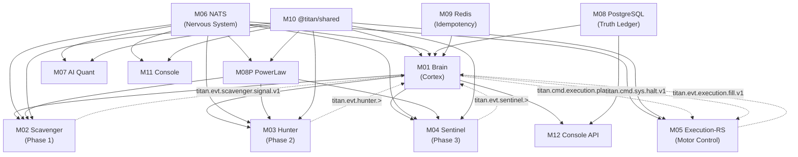

# TITAN Module Audit Template v1

> **Canon**: If it is not in `artifacts/module_audit/…`, it did not happen.
> **No parallel truth**: extend existing repo structures — never create duplicate doc systems.
> **SOTA baseline**: [system-source-of-truth.md](file:///Users/ivan/Code/work/trading/titan/docs/system-source-of-truth.md) + [architecture.md](file:///Users/ivan/Code/work/trading/titan/docs/architecture.md)
> **Domain**: Autonomous Trading Organism — survival-first, profit-second.

---

## 0) Artifact Structure (single source of truth)

Create one audit root per cycle:

```
artifacts/module_audit/YYYY-MM-DD/
├── 00_INDEX.md
├── 01_GATEBOARD.md
├── 02_RISK_REGISTER.md
├── 03_DECISIONS.md
├── 04_INTEGRATION_MATRIX.md
├── 05_SOTA_BASELINE.md
├── modules/
│   └── <MODULE_ID>/
│       ├── 00_SCOPE.md
│       ├── 01_REALITY.md
│       ├── 02_CONTRACTS.md
│       ├── 03_INVARIANTS.md
│       ├── 04_FAILURE_MODES.md
│       ├── 05_TESTS.md
│       ├── 06_OBSERVABILITY.md
│       ├── 07_SECURITY.md
│       ├── 08_PERFORMANCE_COST.md
│       ├── 09_DRIFT_CONTROL.md
│       ├── 10_REMEDIATION_PLAN.md
│       ├── 11_DONE.md
│       └── evidence/
│           └── MANIFEST.md
```

---

## 1) Master Gateboard (`01_GATEBOARD.md`)

Track every module in a single table:

| Module ID | Status | Gate | Fix Policy | Blocked-by | Evidence Links | Owner | Updated |
|-----------|--------|------|------------|------------|----------------|-------|---------|
| … | Not Started / In Progress / Blocked / Done | D/C/B/A | F0/F1/F2 | [module IDs] | [links] | agent/thread | ISO 8601 |

### Gate Tiers (with required evidence)

| Gate | Description | Required Artifacts |
|------|-------------|-------------------|
| **D** | Reality captured | `00_SCOPE.md` + `01_REALITY.md` + `02_CONTRACTS.md` + `03_INVARIANTS.md` + `04_FAILURE_MODES.md` complete |
| **C** | Tests green | D + `05_TESTS.md` complete, all tests passing with evidence in `evidence/` |
| **B** | Determinism + ops | C + `06_OBSERVABILITY.md` + `09_DRIFT_CONTROL.md` complete, HMAC and reconciliation tests green |
| **A** | Production-ready | B + `07_SECURITY.md` + `08_PERFORMANCE_COST.md` complete, circuit-breaker drill evidence, integration validation |

### Fix Policy

| Level | Scope | Approval |
|-------|-------|----------|
| **F0** | Proven-safe: lint, dead code, obvious bugs, config parity, docs-to-code alignment | Self-merge |
| **F1** | Targeted refactor with tests and measurable deltas | Review required |
| **F2** | Architecture: new contracts, risk policy changes, exchange adapter changes | ADR + review |

---

## 2) Risk Register (`02_RISK_REGISTER.md`)

> Trading-specific risks with financial impact.

| ID | Risk | Module(s) | Likelihood | Impact | Mitigation | Status |
|----|------|-----------|------------|--------|------------|--------|
| R-01 | Shadow State drift from Exchange State | M05, M06 | Medium | Critical (fund loss) | Reconciliation loop (1min), drift detection | … |
| R-02 | HMAC secret compromise | M08 | Low | Critical (rogue orders) | Fail-closed `panic!`, rotation policy | … |
| R-03 | Circuit breaker fails to activate | M05 | Low | Critical (drawdown) | Multi-layer enforcement (Brain + Rust) | … |
| R-04 | Risk policy hash mismatch silent fail | M04, M05 | Low | High | SHA256 handshake at boot | … |
| … | … | … | … | … | … | … |

---

## 3) Decision Log (`03_DECISIONS.md`)

| Date | Module | Decision | Rationale | Decided-by | Reversible? |
|------|--------|----------|-----------|------------|-------------|
| … | … | … | … | human/agent | yes/no |

---

## 4) Integration Matrix (`04_INTEGRATION_MATRIX.md`)

Cross-module boundary tests:

| Module A | Module B | Integration Point | NATS Subject | Tested? | Evidence |
|----------|----------|--------------------|--------------|---------|----------|
| M01 Brain | M05 Execution | Intent → Order | `titan.cmd.execution.place.v1.>` | ✅/❌ | [link] |
| M05 Execution | M01 Brain | Fill → Record | `titan.evt.execution.fill.v1` | ✅/❌ | [link] |
| M02 Scavenger | M01 Brain | Signal → Approval | `titan.evt.scavenger.signal.v1` | ✅/❌ | [link] |
| M03 Hunter | M01 Brain | Signal → Approval | `titan.evt.hunter.>` | ✅/❌ | [link] |
| M04 Sentinel | M01 Brain | Signal → Approval | `titan.evt.sentinel.>` | ✅/❌ | [link] |
| M01 Brain | M05 Execution | Risk Command | `titan.cmd.risk.*` | ✅/❌ | [link] |
| M01 Brain | M05 Execution | Halt Command | `titan.cmd.sys.halt.v1` | ✅/❌ | [link] |
| M07 PowerLaw | All Phases | Metrics Broadcast | `powerlaw.metrics.*` | ✅/❌ | [link] |
| M01 Brain | All Phases | Budget Updates | `titan.evt.budget.update.v1` | ✅/❌ | [link] |
| … | … | … | … | … | … |

---

## 5) SOTA Baseline (`05_SOTA_BASELINE.md`)

Pin the exact standards being measured. Reference, don't reinvent:

| Dimension | Standard | Canonical Source |
|-----------|----------|------------------|
| Invariants | System Invariants I-01 through I-20 | [system-source-of-truth.md §2](file:///Users/ivan/Code/work/trading/titan/docs/system-source-of-truth.md) |
| Risk Policy | Canonical risk parameters, hash-verified cross-language | [risk_policy.json](file:///Users/ivan/Code/work/trading/titan/packages/shared/risk_policy.json) |
| HMAC Security | Fail-closed signing, envelope validation | [security.md §3](file:///Users/ivan/Code/work/trading/titan/docs/security.md) |
| Circuit Breakers | Normal → Cautious → Defensive → Emergency | [circuit_breakers.md](file:///Users/ivan/Code/work/trading/titan/docs/risk/circuit_breakers.md) |
| NATS ACLs | Per-service publish/subscribe isolation | [nats.conf](file:///Users/ivan/Code/work/trading/titan/config/nats.conf) |
| Reconciliation | Shadow State vs Exchange State every 1 min | [system-source-of-truth.md §10.6](file:///Users/ivan/Code/work/trading/titan/docs/system-source-of-truth.md) |
| Observability | SLOs, metrics, tracing per [slos.yaml](file:///Users/ivan/Code/work/trading/titan/monitoring/slos.yaml) | [metrics-catalog.md](file:///Users/ivan/Code/work/trading/titan/docs/operations/metrics-catalog.md) |
| Data Integrity | RLS, partitioned tables, fill dedup | [schema.sql](file:///Users/ivan/Code/work/trading/titan/services/titan-brain/src/db/schema.sql) |
| Quality Gates | CI pipeline (7 jobs), SOTA checks | [ci.yml](file:///Users/ivan/Code/work/trading/titan/.github/workflows/ci.yml) |
| Idempotency | Redis signal cache, nonce tracking, fill dedup | [system-source-of-truth.md §9.4](file:///Users/ivan/Code/work/trading/titan/docs/system-source-of-truth.md) |

---

## 6) Per-Module Audit Pages

Copy the structure below for every module under `modules/<MODULE_ID>/`.

---

### A) Scope and Boundaries (`00_SCOPE.md`)

```markdown
# Module: <MODULE_ID>

## Identity
- **Name**:
- **Purpose**:
- **Architectural plane**: Sense / Cortex / Motor / Nervous System / Data / Infrastructure / Operator

## Code Packages (exhaustive)
- `services/…`
- `packages/…`
- `apps/…`

## Owner Surfaces
- **Human-facing**: (API endpoint, UI panel, CLI command, WebSocket)
- **Machine-facing**: (NATS subjects, internal interfaces, exchange adapters)

## Boundaries
- **Inputs**:
- **Outputs**:
- **Dependencies** (other modules):
- **Non-goals**:
```

---

### B) Reality Snapshot (`01_REALITY.md`)

> What the code actually does today vs. what docs claim.

```markdown
## Build Status
- [ ] Compiles cleanly
- [ ] Lint passes
- [ ] Tests pass

## Doc-to-Code Alignment
| Claim (from docs) | Code Reality | Gap? |
|--------------------|-------------|------|
| … | … | ✅/❌ |

## Exchange Connectivity (if applicable)
| Exchange | Protocol | Adapter File | Tested Live? |
|----------|----------|--------------|-------------|
| Bybit | REST + WS | `exchange/bybit.rs` | ✅/❌ |
| Binance | REST + WS | `exchange/binance.rs` | ✅/❌ |
```

---

### C) Contract Inventory (`02_CONTRACTS.md`)

> **Rule**: If an integration exists without a contract listed here, it is a production bug.

```markdown
## NATS Subjects (this module)
| Subject | Direction | Schema | Signed? | Idempotency |
|---------|-----------|--------|---------|-------------|
| `titan.cmd.…` | publish/subscribe | `IntentEnvelope` | yes/no | … |
| `titan.evt.…` | publish/subscribe | `FillEvent` | yes/no | … |

## API Contracts
| Endpoint | Method | Auth | Rate Limit | Notes |
|----------|--------|------|------------|-------|
| `/health` | GET | none | — | All services |
| `/metrics` | GET | none | — | Prometheus scrape |

## Exchange API Contracts (if applicable)
| API | Endpoint | Rate Limit | Error Handling |
|-----|----------|-----------|----------------|

## DB Tables Owned
| Table | Partitioned? | RLS? | Owner Service |
|-------|-------------|------|---------------|

## Config and Environment
| Key | Type | Default | Fail-Closed? |
|-----|------|---------|--------------|
| `HMAC_SECRET` | string | — | yes (`panic!`) |

## Error Taxonomy
| Code | Retryable | Fail-closed | Financial Impact? | Description |
|------|-----------|-------------|-------------------|-------------|
```

---

### D) Invariants (`03_INVARIANTS.md`)

> Cross-reference system invariants I-01 through I-20 from [system-source-of-truth.md](file:///Users/ivan/Code/work/trading/titan/docs/system-source-of-truth.md).

```markdown
## Control Loop (Cybernetics Lens)

### Essential Variables (what must never drift)
- Shadow State accuracy
- Circuit breaker state
- Risk policy hash parity
-

### Sensors (how you observe reality)
- Exchange WebSocket feeds
- Reconciliation REST queries
- NATS event stream
-

### Actuators (what you can change)
- Order placement / cancellation
- Position sizing
- Circuit breaker transitions
- System halt
-

### Regulator Policy (what governs action)
- Risk policy (hash-locked)
- HMAC signing
- NATS ACLs
-

### Time Constants
- Reconciliation cadence: 1 min
- HMAC timestamp tolerance: 5 min (300,000ms)
- Signal cache TTL: 5 min
- Rate limit: 10 RPS per exchange
-

### Variety Budget
- **Input variety**: 3 symbols × 3 phases × N concurrent signals
- **Attenuation**: symbol whitelist, risk guard, rate limiter
- **Amplification**: phase fan-out, multi-exchange routing

## Module Invariants

| # | Invariant | System ID | Enforcement | Test | Evidence |
|---|-----------|-----------|-------------|------|----------|
| 1 | … | I-01..I-20 | How enforced | Command or test name | Link |
```

---

### E) Failure Modes and Blast Radius (`04_FAILURE_MODES.md`)

> **Rule**: If you cannot describe recovery deterministically, you do not own the module.
> **Trading context**: Every failure mode must state financial impact.

| # | Failure Mode | Trigger | Detection Signal | Auto Containment | Manual Runbook | Fund Risk? | Customer Impact | Recovery Steps | RTO | RPO |
|---|-------------|---------|-----------------|-----------------|----------------|-----------|----------------|----------------|-----|-----|
| 1 | Exchange WS disconnect | Network partition | Health check + stale ticker | Reconcile loop + position freeze | Operator ARM command | yes/no | Position exposure frozen | … | 30s | 0 |
| 2 | HMAC validation failure | Clock drift / key mismatch | Rejection metric spike | Commands rejected (fail-closed) | Rotate secret, restart | no | No new orders | … | 5m | 0 |
| 3 | Circuit breaker: Emergency | Max daily loss breached | `RiskState::Emergency` | Flatten all positions | Operator ARM to re-enable | yes | All positions liquidated | … | — | 0 |
| 4 | Shadow State drift | Exchange state mismatch | Drift alert metric | Risk freeze (no new risk) | Manual reconcile | yes | Trading halted | … | 1m | 0 |
| … | … | … | … | … | … | … | … | … | … | … |

---

### F) Tests and Verification Harness (`05_TESTS.md`)

| Category | Exists? | Passes? | Meaningful? | Command (local) | Command (CI) | Expected Artifacts | Runtime Budget | Evidence |
|----------|---------|---------|-------------|-----------------|--------------|-------------------|---------------|----------|
| Unit tests (TS) | ✅/❌ | ✅/❌ | ✅/❌ | `npm run test` | CI `node-services` | Jest reports | <30s | [link] |
| Unit tests (Rust) | ✅/❌ | ✅/❌ | ✅/❌ | `cargo test` | CI `rust-services` | — | <30s | [link] |
| HMAC signing tests | | | | `cargo test hmac` | CI | — | — | |
| Risk guard tests | | | | `cargo test risk` | CI | — | — | |
| Circuit breaker tests | | | | `cargo test circuit` | CI | — | — | |
| Integration tests | | | | `scripts/adversarial_drills.sh` | — | drill report | — | |
| Reconciliation tests | | | | `scripts/acceptance-drill.ts` | — | — | — | |
| Simulation suite | | | | `scripts/simulation_suite.ts` | — | sim report | — | |
| Config validation | | | | `npm run validate:config` | CI `config-validation` | — | <5s | |
| SOTA checks | | | | `npm run sota:*` | CI `sota-checks` | — | — | |
| Contract/schema drift | | | | `npm run sota:contract` | CI `contract-check` | — | — | |
| E2E (paper trading) | | | | `scripts/boot_micro.sh` | — | — | — | |

---

### G) Observability and Operations (`06_OBSERVABILITY.md`)

```markdown
## SLOs and SLIs
| SLI | SLO Target | Measurement | Window |
|-----|-----------|-------------|--------|
| Order latency p99 | < 500ms | Execution metrics | 5m |
| HMAC rejection rate | < 1/min | Execution metrics | 1m |
| Reconciliation drift | 0 | Brain reconciler | 1m |

## Metrics
| Metric Name | Type | Labels | Alert Threshold |
|-------------|------|--------|----------------|
| `position_exposure` | gauge | symbol | > 80% of max notional |
| `account_leverage` | gauge | — | > 8x |
| `daily_drawdown` | gauge | — | > 50% consumed → alert |
| `hmac_rejections_total` | counter | reason | > 1/min |

## Logs
| Structured Field | Required? | Description |
|-----------------|-----------|-------------|
| `signal_id` | yes | UUID v4 end-to-end tracking |
| `correlation_id` | yes | UUID v4 request correlation |
| `order_id` | yes | Exchange-provided order ID |
| `fill_id` | yes | Exchange-provided fill ID |

## Traces
| Span Name | Correlation ID | Parent |
|-----------|---------------|--------|
| `signal_to_fill` | signal_id | — |

## Dashboards and Alerts
| Dashboard | Tool | SLOs Mapped |
|-----------|------|------------|
| Trading Overview | Grafana | Exposure, leverage, PnL |
| Execution Health | Grafana | Latency, rejection rate |
| NATS Health | NATS `:8222/varz` | Stream lag, consumer pending |

## On-Call Runbook
- Runbook entries: `docs/runbooks/…`
- Operator commands: ARM, DISARM, HALT via `titan.cmd.operator.*`
```

> **Rule**: No black boxes. Every production failure must have a first-minute diagnosis path.

---

### H) Security Posture (`07_SECURITY.md`)

Reference existing: [security.md](file:///Users/ivan/Code/work/trading/titan/docs/security.md)

```markdown
## Threat Model Summary (top threats for this module)
1.

## NATS ACL Boundaries
- Service identity: `brain` / `execution` / `scavenger` / `hunter` / `sentinel` / `powerlaw` / `quant` / `console`
- Trust zone: Full Access / Publish-only / Subscribe-only

## HMAC Signing Coverage
| Boundary | What is Signed | Verification Point |
|----------|----------------|-------------------|
| Brain → Execution | `ts.nonce.payload_json` | `security.rs` |
| Operator → Execution | `timestamp:action:actor_id:command_id` | `security.rs` |

## Secrets Handling
| Secret | Storage | Rotation Policy | Fail-Closed? |
|--------|---------|----------------|--------------|
| `HMAC_SECRET` | `.env` / Vault | Quarterly | yes (`panic!`) |
| Exchange API keys | `.env` / Vault | On-compromise | yes |
| `TITAN_MASTER_PASSWORD` | `.env` / Vault | Quarterly | yes |

## Supply Chain Controls
- `npm audit` + `cargo audit` in CI
- SBOM generation
- License compliance: `npm run sota:license`

## Exchange Credential Isolation
| Control | Mechanism |
|---------|-----------|
| API key scope | Trade-only (no withdrawal) |
| IP whitelist | Production VPS IPs only |
```

---

### I) Performance and Cost Budgets (`08_PERFORMANCE_COST.md`)

```markdown
## Latency Budget
| Operation | P50 | P95 | P99 | Hard Limit |
|-----------|-----|-----|-----|------------|
| Signal → Intent | | | | 100ms |
| Intent → Order submitted | | | | 200ms |
| Order → Fill confirmed | | | < 500ms | 1000ms |

## Throughput Target
- 10 RPS per exchange (rate limiter cap)
- 3 symbols × 3 phases = 9 concurrent signal streams

## Resource Budgets
| Resource | Budget | Measurement |
|----------|--------|-------------|
| CPU (Brain) | | |
| Memory (Brain) | | |
| CPU (Execution) | | |
| Memory (Execution) | | |
| Redb storage growth | | |
| PostgreSQL storage | | |

## Trading Cost Budget
| Unit | Cost | Measurement |
|------|------|-------------|
| Per trade (fees) | Maker/Taker from `fee_schedule.json` | Exchange reports |
| Per signal (compute) | | |
| Daily infra cost | | DigitalOcean billing |
| Slippage budget | < 100 bps | Execution quality metrics |

## CI Impact
| Metric | Target | Current |
|--------|--------|---------|
| TS build time | < 60s | |
| Rust build time (release) | < 180s | |
| Test time (unit) | < 30s | |
| SOTA checks | < 30s | |
```

> **Rule**: If cost is not measured, it is not controlled.

---

### J) Drift Control and Upgrade Strategy (`09_DRIFT_CONTROL.md`)

```markdown
## Doc-to-Code Sync
- Enforcement: `scripts/verify-docs.sh`
- CI gate: `contract-check` job

## Risk Policy Sync (TS ↔ Rust)
- Source: `packages/shared/risk_policy.json`
- Copy: `services/titan-execution-rs/src/risk_policy.json`
- Enforcement: SHA256 hash comparison at boot
- Evidence: `shasum -a 256 packages/shared/risk_policy.json services/titan-execution-rs/src/risk_policy.json`

## NATS Subject Canonicalization
- Source: `packages/shared/src/messaging/powerlaw_subjects.ts`
- Enforcement: `scripts/sota/check_nats_subjects.sh`

## Schema Drift Detection
- DB schema: `services/titan-brain/src/db/schema.sql`
- NATS intent schema: `docs/contracts/nats-intent.v1.schema.json`
- Enforcement: `contract-check` CI job

## Exchange Adapter Versioning
- Bybit API version pin:
- Binance API version pin:

## Upgrade Playbook
- Rolling upgrade: blue/green via `scripts/deploy_prod.sh`
- Risk policy change: requires both Brain + Execution redeployment
- NATS config change: requires `nats-server --signal reload`
```

---

### K) Remediation Plan (`10_REMEDIATION_PLAN.md`)

| # | Finding | Impact | Fix Policy | Current Signal | Proposed Change | Tests Added | Evidence to Collect | Gate Target |
|---|---------|--------|------------|----------------|-----------------|-------------|--------------------|----|
| 1 | … | Critical/High/Med/Low | F0/F1/F2 | … | … | … | … | D/C/B/A |

---

### L) Definition of Done (`11_DONE.md`)

```markdown
## Gate Achieved: [D/C/B/A]
## Justification:

## Checklist
- [ ] All invariants enforced with tests
- [ ] Circuit breaker drill run and evidence in `evidence/`
- [ ] Reconciliation drill run and evidence in `evidence/`
- [ ] Exchange connectivity verified (paper trading)
- [ ] Integration validated end-to-end via NATS (see `04_INTEGRATION_MATRIX.md`)
- [ ] No known critical gaps remain
- [ ] Evidence manifest complete (`evidence/MANIFEST.md`)

## Evidence Links
-
```

---

### M) Evidence Manifest (`evidence/MANIFEST.md`)

| File | SHA-256 | Produced By | Proves | Timestamp |
|------|---------|-------------|--------|-----------|
| unit_test_run.log | … | `npm run test` / `cargo test` | Unit coverage | … |
| circuit_breaker_drill.log | … | `scripts/adversarial_drills.sh` | Breaker activation | … |
| reconciliation_drill.log | … | `scripts/acceptance-drill.ts` | Shadow ↔ Exchange convergence | … |
| risk_policy_hash.txt | … | `shasum -a 256` | TS ↔ Rust parity | … |
| … | … | … | … | … |

---

## 7) The Module List — Grounded in Repo

Modules map to real code. Every `services/` directory and `packages/` directory must be claimed by exactly one module. Unclaimed packages are audit findings.

### Priority tiers

| Tier | Gate required | Rationale |
|------|--------------|-----------|
| **P0** (must be Gate A) | Production-ready | Touches real money — exchange orders, risk enforcement, position state |
| **P1** (must be Gate C) | Tests green | Required infrastructure or strategy, but not on the order execution hot path |
| **P2** (Gate D acceptable) | Reality captured | Research, offline analysis, or not yet deployed |

---

### Cortex Plane — Decision Making (P0)

#### M01 — Titan Brain (The Cortex)

| Attribute | Value |
|-----------|-------|
| **Service** | `services/titan-brain/` |
| **Language** | TypeScript |
| **Port** | 3100 |
| **Entrypoint** | `services/titan-brain/src/index.ts` |
| **Plane** | Cortex |
| **Role** | State aggregation, allocation, regime detection, risk governance, signal approval |
| **DB Tables Owned** | `allocation_history`, `phase_trades`, `phase_performance`, `brain_decisions`, `treasury_operations`, `circuit_breaker_events`, `risk_snapshots`, `high_watermark`, `system_state`, `manual_overrides`, `operators`, `fills`, `event_log`, `ledger_accounts`, `ledger_transactions`, `ledger_entries` |
| **Depends on** | M06 (NATS), M08 (Postgres), M09 (Redis), M10 (Shared) |
| **Depended on by** | M02, M03, M04, M05, M07, M11, M12 |

---

### Sense Organs — Strategy Plane (P1)

#### M02 — Phase 1: Scavenger (Trap/Scalp)

| Attribute | Value |
|-----------|-------|
| **Service** | `services/titan-phase1-scavenger/` |
| **Language** | TypeScript |
| **Port** | 8081 |
| **Plane** | Sense |
| **Role** | High-frequency, low-capital trap system; detects short-term inefficiencies |
| **Publishes** | `titan.evt.scavenger.signal.v1`, `titan.evt.phase.>` |
| **Subscribes** | `powerlaw.metrics.>`, `titan.evt.budget.update.v1` |
| **Depends on** | M01, M06, M07, M10 |
| **Depended on by** | — |

#### M03 — Phase 2: Hunter (Holographic)

| Attribute | Value |
|-----------|-------|
| **Service** | `services/titan-phase2-hunter/` |
| **Language** | TypeScript |
| **Port** | 8083 |
| **Plane** | Sense |
| **Role** | Holographic market structure analysis; medium-term trend detection |
| **Publishes** | `titan.evt.hunter.>`, `titan.evt.phase.>` |
| **Subscribes** | `titan.cmd.hunter.>`, `powerlaw.metrics.>` |
| **Depends on** | M01, M06, M07, M10 |
| **Depended on by** | — |

#### M04 — Phase 3: Sentinel (Arbitrage)

| Attribute | Value |
|-----------|-------|
| **Service** | `services/titan-phase3-sentinel/` |
| **Language** | TypeScript |
| **Port** | 8084 |
| **Plane** | Sense |
| **Role** | Delta-neutral arbitrage; low risk, steady yield |
| **Publishes** | `titan.evt.sentinel.>`, `titan.evt.phase.>` |
| **Subscribes** | `titan.cmd.sentinel.>`, `powerlaw.metrics.>` |
| **Depends on** | M01, M06, M07, M10 |
| **Depended on by** | — |

---

### Motor Control — Execution Plane (P0)

#### M05 — Execution Engine (Rust)

| Attribute | Value |
|-----------|-------|
| **Service** | `services/titan-execution-rs/` |
| **Language** | Rust |
| **Port** | 3002 |
| **Entrypoint** | `services/titan-execution-rs/src/main.rs` |
| **Plane** | Motor |
| **Role** | Low-latency order execution, position management, risk guard, circuit breakers, HMAC validation, exchange connectivity, shadow state, reconciliation |
| **Key Files** | `nats_engine.rs`, `risk_guard.rs`, `security.rs`, `shadow_state.rs`, `circuit_breaker.rs`, `armed_state.rs`, `risk_policy.rs`, `rate_limiter.rs`, `drift_detector.rs`, `order_manager.rs`, `pipeline.rs` |
| **Publishes** | `titan.evt.execution.fill.v1`, `titan.evt.execution.>`, `titan.evt.phase.>` |
| **Subscribes** | `titan.cmd.execution.place.v1.>`, `titan.cmd.risk.>`, `titan.cmd.sys.halt.v1` |
| **Depends on** | M06, M10 |
| **Depended on by** | M01 |

---

### Nervous System — Event Bus (P0)

#### M06 — NATS JetStream (Central Nervous System)

| Attribute | Value |
|-----------|-------|
| **Config** | `config/nats.conf` |
| **Infrastructure** | Docker image `nats:2.10.22-alpine` |
| **Port** | 4222 (client), 8222 (monitoring) |
| **Plane** | Nervous System |
| **Role** | Event persistence, command routing, ACL enforcement |
| **Streams** | `TITAN_COMMANDS` (`titan.cmd.>`), `TITAN_EVENTS` (`titan.evt.>`), `TITAN_DATA` (`titan.data.>`) |
| **ACL Matrix** | 8 users: `brain`, `execution`, `scavenger`, `hunter`, `sentinel`, `powerlaw`, `quant`, `console` |
| **Depends on** | — |
| **Depended on by** | M01, M02, M03, M04, M05, M07, M11 |

---

### Research and Optimization Plane (P2)

#### M07 — AI Quant (Research Engine)

| Attribute | Value |
|-----------|-------|
| **Service** | `services/titan-ai-quant/` |
| **Language** | TypeScript |
| **Port** | 8082 |
| **Plane** | Research |
| **Role** | Offline and near-realtime parameter optimization via Gemini 2.0 Flash |
| **Publishes** | `titan.evt.quant.>`, `titan.cmd.ai.>` |
| **Subscribes** | `titan.cmd.ai.>`, `titan.evt.>`, `titan.data.powerlaw.>` |
| **Depends on** | M06, M10 |
| **Depended on by** | M03 |

#### M08P — PowerLaw Lab

| Attribute | Value |
|-----------|-------|
| **Service** | `services/titan-powerlaw-lab/` |
| **Language** | TypeScript |
| **Port** | — |
| **Plane** | Research |
| **Role** | Power law analysis, market regime classification |
| **Publishes** | `titan.evt.powerlaw.>`, `titan.data.powerlaw.>`, `titan.ai.>` |
| **Subscribes** | `titan.data.market.>`, `titan.evt.>` |
| **Depends on** | M06, M10 |
| **Depended on by** | M02, M03, M04 |

---

### Data Plane (P0/P1)

#### M08 — PostgreSQL (Truth Ledger, P0)

| Attribute | Value |
|-----------|-------|
| **Infrastructure** | Docker image `postgres:16-alpine` |
| **Port** | 5432 |
| **Schema** | `services/titan-brain/src/db/schema.sql` |
| **Migrations** | `services/titan-brain/migrations/` |
| **Plane** | Data |
| **Role** | Primary truth ledger — fills, events, decisions, allocations, accounting |
| **Properties** | RLS enabled on all tables; `fills` and `event_log` partitioned by month |
| **Depends on** | — |
| **Depended on by** | M01 |

#### M09 — Redis (Idempotency Cache, P1)

| Attribute | Value |
|-----------|-------|
| **Infrastructure** | Docker image `redis:alpine` |
| **Config** | `config/redis-secure.conf` |
| **Port** | 6379 |
| **Plane** | Data |
| **Role** | Signal deduplication cache, distributed state management |
| **Depends on** | — |
| **Depended on by** | M01 |

---

### Shared Libraries (P0)

#### M10 — @titan/shared (Canonical Contracts)

| Attribute | Value |
|-----------|-------|
| **Package** | `packages/shared/` |
| **Language** | TypeScript |
| **Plane** | Cross-cutting |
| **Role** | Canonical schemas, NATS client, messaging contracts, risk policy (Zod), fee schedule, config management, observability, governance |
| **Key Artifacts** | `risk_policy.json`, `fee_schedule.json`, `src/messaging/powerlaw_subjects.ts`, `src/schemas/*.ts`, `src/messaging/NatsClient.ts`, `src/messaging/ExecutionClient.ts` |
| **Depends on** | — |
| **Depended on by** | M01, M02, M03, M04, M05, M07, M08P |

---

### Operator Plane (P1)

#### M11 — Titan Console (Operator UI)

| Attribute | Value |
|-----------|-------|
| **App** | `apps/titan-console/` |
| **Language** | React / Vite |
| **Port** | 3001 |
| **Plane** | Operator |
| **Role** | Real-time dashboard, position monitoring, operator commands (ARM/DISARM/HALT) |
| **Subscribes** | `titan.data.>`, `titan.evt.>` |
| **Depends on** | M06, M10, M12 |
| **Depended on by** | — |

#### M12 — Console API

| Attribute | Value |
|-----------|-------|
| **Service** | `services/titan-console-api/` |
| **Language** | TypeScript |
| **Plane** | Operator |
| **Role** | API backend for Console UI |
| **Depends on** | M01, M08 |
| **Depended on by** | M11 |

---

### Operations and OpsD (P1)

#### M13 — OpsD (Operations Daemon)

| Attribute | Value |
|-----------|-------|
| **Service** | `services/titan-opsd/` |
| **Language** | TypeScript |
| **Plane** | Infrastructure |
| **Role** | Operational automation, health checks, scheduled tasks |
| **Depends on** | M06, M08 |
| **Depended on by** | — |

---

### Quality and Testing (P1)

#### M14 — Quality OS

| Attribute | Value |
|-----------|-------|
| **Package** | `packages/quality-os/` |
| **Plane** | Cross-cutting |
| **Role** | Quality gates, SOTA checks, compliance verification |
| **Scripts** | `scripts/sota/*`, `scripts/ci/*` |
| **CI Jobs** | All 7 CI jobs |
| **Depends on** | M10 |
| **Depended on by** | — |

#### M15 — Backtesting Harness

| Attribute | Value |
|-----------|-------|
| **Package** | `packages/titan-backtesting/` |
| **Harness** | `packages/titan-harness/` |
| **Plane** | Research |
| **Role** | Historical strategy validation, simulation |
| **Related** | `simulation/`, `valuation/` |
| **Depends on** | M10 |
| **Depended on by** | — |

---

### Infrastructure (P1)

#### M16 — Monitoring Stack

| Attribute | Value |
|-----------|-------|
| **Directory** | `monitoring/` |
| **Components** | Prometheus, Grafana, Tempo, Loki, Promtail, Alertmanager |
| **Config** | `monitoring/slos.yaml`, `monitoring/alertmanager/`, `monitoring/promtail/`, `monitoring/loki/`, `monitoring/tempo/` |
| **Plane** | Infrastructure |
| **Depends on** | M01, M05 |
| **Depended on by** | — |

#### M17 — Deployment and Infrastructure

| Attribute | Value |
|-----------|-------|
| **Files** | `docker-compose.yml`, `docker-compose.prod.yml`, `docker-compose.dev.yml`, `docker-compose.secrets.yml`, `Makefile`, `ecosystem.config.js` |
| **Scripts** | `scripts/deploy_prod.sh`, `scripts/setup-vps.sh`, `scripts/boot_prod_like.sh`, `scripts/boot_micro.sh` |
| **Infra** | `infra/`, `config/` |
| **CI/CD** | `.github/workflows/ci.yml`, `.github/workflows/deploy-prod.yml` |
| **Plane** | Infrastructure |
| **Depends on** | All services |
| **Depended on by** | — |

#### M18 — Disaster Recovery

| Attribute | Value |
|-----------|-------|
| **Config** | `config/disaster-recovery.config.json`, `config/disaster-recovery-testing.config.json`, `config/hot-standby.config.json` |
| **Scripts** | `scripts/backup-db.sh`, `scripts/restore-db.sh`, `scripts/rollback.sh` |
| **Docs** | `docs/operations/reliability/` |
| **Plane** | Infrastructure |
| **Depends on** | M08, M17 |
| **Depended on by** | — |

---

### Package Coverage Verification

Run this to find unclaimed code:

```bash
# List all services
ls -d services/*/ | sort > /tmp/all_services.txt

# List all packages
ls -d packages/*/ | sort > /tmp/all_packages.txt

# List all apps
ls -d apps/*/ | sort > /tmp/all_apps.txt

# Compare against claimed modules in gateboard
# Any unclaimed directory is an audit finding
```

---

## 8) Dependency Graph



> **Consequence**: If M06 (NATS) or M08 (PostgreSQL) are below Gate C, no downstream module can reach Gate B.
> **Critical path**: M05 (Execution) and M01 (Brain) must be Gate A before any real-money trading.

---

## 9) Execution Protocol (for any implementation agent)

1. **Fail-closed by default**: If risk policy, HMAC, or circuit breaker state is uncertain, refuse execution.
2. **Evidence-first**: Every claim links to exact files, commands run, outputs captured, and SHA-256 hashes.
3. **No parallel truth**: Extend existing `artifacts/module_audit/YYYY-MM-DD/` — never create duplicate doc systems.
4. **Gate progression is monotonic**: D → C → B → A. Never skip tiers. Never regress without a `03_DECISIONS.md` entry.
5. **SOTA baseline is pinned**: Measure against `05_SOTA_BASELINE.md`, not vibes.
6. **Produce artifacts in the tree**: `artifacts/module_audit/YYYY-MM-DD/modules/<MODULE_ID>/`.
7. **Priority-first**: Complete all P0 modules to their required gate before starting P1.
8. **Cross-reference on close**: Before marking any module Done, check `04_INTEGRATION_MATRIX.md` for boundary coverage.
9. **Evidence manifest is mandatory**: `evidence/MANIFEST.md` with SHA-256 hashes for every file.
10. **Double-check completeness**: Re-read the Gate tier evidence requirements before advancing.
11. **Financial impact assessment**: Every failure mode must state whether real funds are at risk.
12. **Exchange credential isolation**: Never log, expose, or transmit exchange API keys outside their trust zone.
