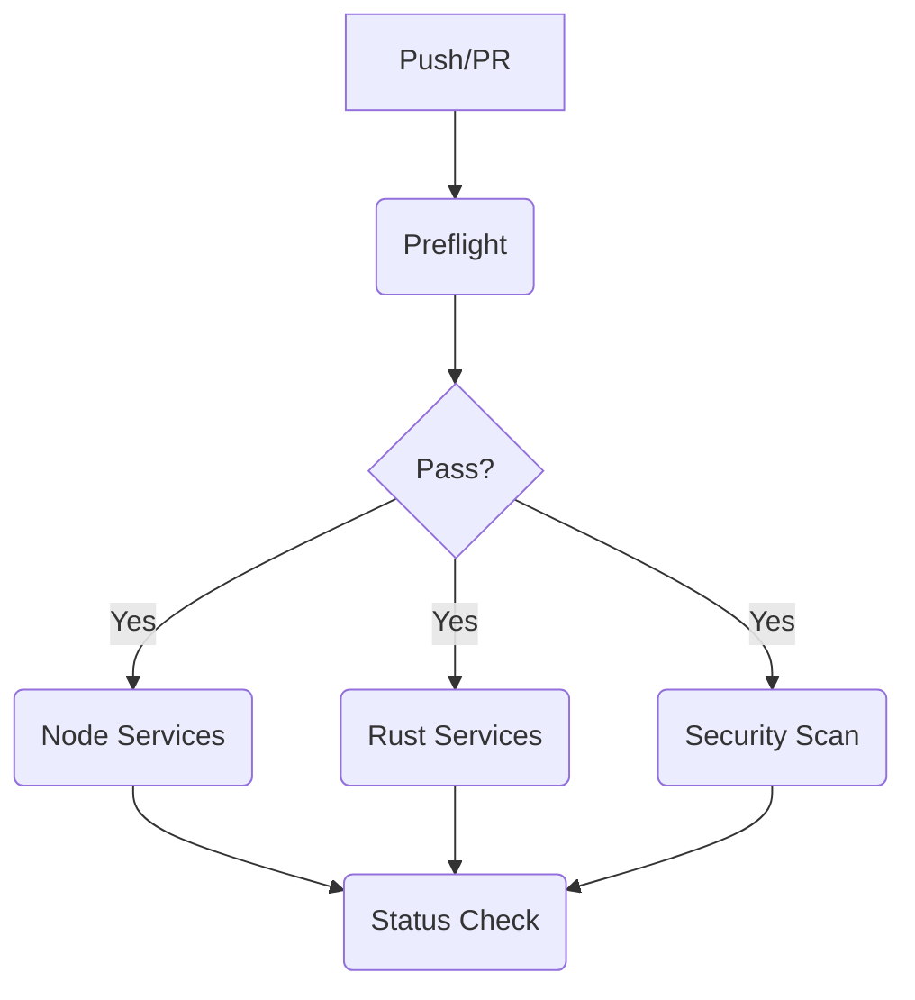

# CI SOTA Report: Surgery & Upgrade (Feb 2026)

## 1. Failure Matrix & Root Causes

| Failure | Root Cause | Fix |
| :--- | :--- | :--- |
| `rust-services` Build Fail | Toolchain drift (using `stable` vs `1.89.0`) | **Pinned Toolchain**: Added `rust-toolchain.toml` (1.89.0) |
| `contract-check` Fail | Duplicate Identifier `DISARM` in `ops-command.ts` | **Manual Fix**: Corrected enum definition in source |
| `shared` Build Fail | Missing dependency `@opentelemetry/api` | **Dependency Fix**: `npm install` to update lockfile |
| Flaky/Redundant CI | Redundant `npm install` per matrix job | **SOTA Architecture**: Single `node-services` job with Turbo |

## 2. New CI Topology (SOTA)

The workflow is now structured for **speed** and **correctness**:

### Key Improvements
- **Fail-Fast Preflight**: Config, Env, Contracts, and Hygiene checks run first. If they fail, we save compute.
- **Selective Execution**: Node.js services run via `turbo run build test lint`.
    - On PRs: Uses `git diff origin/main...HEAD` to only run affected packages.
    - On Push: Runs all (with aggressive caching).
- **Rust Caching**: Uses `swatinem/rust-cache` to cache Cargo registry and build artifacts, keyed by lockfile and toolchain.
- **Pinned Dependencies**: `npm ci` enforced globally. Rust `1.89.0` pinned.

## 3. Cache Keys Policy

- **Node**: `os`-`node-22`-`package-lock.json`
- **Turbo**: `.turbo` directory (hashed by inputs)
- **Rust**: `os`-`rust-1.89.0`-`Cargo.lock`

## 4. Rollback Plan

If CI is broken by the new topology:
1. Revert changes to `.github/workflows/ci.yml`.
2. Keep `rust-toolchain.toml` (it is low risk).
3. Run `npm install` locally to ensure lockfile is valid.
