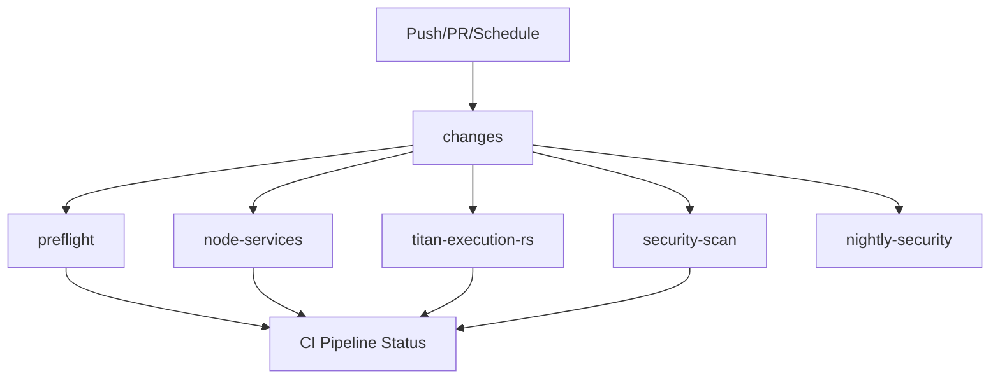

# CI SOTA Report (February 2026)

## 1. Snapshot Reality

- Failing commit (legacy matrix CI): `533eba032f36574b25de90f6d700f3d24e742fca`
- Failing commit (new topology baseline): `e0e6398b18c9d83b0aab558280145bb45b9999ca`

Evidence runs:

- Legacy matrix CI failure: https://github.com/peycheff-com/titan-trading-system/actions/runs/21730841598
- New topology baseline CI failure: https://github.com/peycheff-com/titan-trading-system/actions/runs/21732983564
- Deploy readiness failure: https://github.com/peycheff-com/titan-trading-system/actions/runs/21731006684

## 2. Failure Matrix

| Check | First failing step | Error excerpt | Domain | Evidence |
|---|---|---|---|---|
| `contract-check` | `./scripts/ci/check_contracts.sh` | `TS2300: Duplicate identifier 'DISARM'` | Node/Contracts | Run `21730841598` |
| `packages/shared` | `eslint src/**/*.ts` | `Duplicate enum member value disarm` | Node/Lint | Run `21730841598` |
| `services/*`, `apps/titan-console` (legacy matrix) | shared build dependency | `TS2300: Duplicate identifier 'DISARM'` | Node/Build | Run `21730841598` |
| `titan-execution-rs` (legacy) | `cargo fmt -- --check` | rustfmt diff in `src/exchange/hyperliquid.rs` | Rust/Fmt | Run `21730841598` |
| `titan-execution-rs` (new topology) | `cargo fmt -- --check` | rustfmt diff in `src/contracts.rs` (`Serialize, Deserialize` order) | Rust/Fmt | Job `62691665157` in run `21732983564` |
| `security-scan` | `npm audit --audit-level=high` | `@modelcontextprotocol/sdk` and `@isaacs/brace-expansion` high advisories | Security/Dependencies | Job `62691665139` in run `21732983564` |
| `node-services` | `turbo run build lint test` -> `titan-console#lint` | `@typescript-eslint/no-empty-object-type` in `src/components/ui/textarea.tsx` | Node/Lint | Job `62692029138` in run `21732983564` |
| `Deploy to Production / readiness-gate` | `scripts/ci/gatekeeper.ts` | false positives: dirty repo and private-key self-match | Deploy/Gatekeeper | Run `21731006684` |
| `CI Pipeline Status` | aggregation | fails after upstream failures | Aggregation | Runs above |

## 3. Root Causes to Fix Mapping

### Cluster A: Shared contracts and schema drift

- Duplicate `DISARM` in shared ops command schema caused cascade failures.
- Rust contract generation produced non-rustfmt-stable imports.

Fixes:

- Deduplicated ops command schema enum.
- Hardened Rust contract generation output ordering in `packages/shared/scripts/generate-rust.ts`.

### Cluster B: Security gate failures

- NPM audit high advisories in transitive dependencies.
- Cargo audit vulnerability (`RUSTSEC-2026-0007`, `bytes 1.11.0`).

Fixes:

- Updated lockfile via deterministic audit remediation for npm graph.
- Updated Rust lockfile to `bytes 1.11.1`.

### Cluster C: Rust quality gate unmasked after fmt

- Clippy `new_without_default` in `DexValidator` blocked `-D warnings`.

Fix:

- Added `Default` implementation for `DexValidator`.

### Cluster D: Deploy readiness false positives

- `readiness-gate` installed tooling in-worktree (`npm install --no-save tsx`), violating clean-tree check.
- Private-key scan self-matched scanner script text.

Fixes:

- Switched to non-mutating execution: `npm exec --yes --package=tsx -- tsx ...`.
- Updated scan exclusions to avoid self-match.

### Cluster E: Node services lint hard error

- `apps/titan-console` had one lint error (warnings are non-blocking).

Fix:

- Replaced empty interface with equivalent type alias in textarea component props.

## 4. Fix Commits (PR #1)

- `65050fb1` `ci: fix failing checks`
- `7062105f` `ci: fix rust clippy and cargo audit blockers`
- `aa37be8e` `ci: fix titan-console lint hard error`

## 5. CI Topology Upgrade (PR #2)

New workflow shape:

What changed:

- Added `changes` classifier for path-aware execution.
- Added docs-only short-circuit to skip heavy jobs while preserving aggregator signal.
- Pinned Node to `22.19.0` and npm to `11.6.2` for deterministic runtime.
- Kept Rust pinned to `1.89.0` and used `swatinem/rust-cache`.
- Added workflow-level `concurrency` with cancel-in-progress.
- Added nightly security job with artifacted audits and SBOM.
- Preserved stable aggregator check name: `CI Pipeline Status`.

## 6. Cache Key Policy

- Node package cache: managed by `actions/setup-node` with `cache: npm` and `**/package-lock.json`.
- Turbo cache: `${runner.os}-turbo-${NODE_VERSION}-${hash(package-lock.json,turbo.json)}`.
- Rust cache: managed by `swatinem/rust-cache` keyed by toolchain + lockfile.

## 7. Timing Evidence (Actions)

| Metric | Legacy matrix run `21730841598` | New topology baseline run `21732983564` |
|---|---:|---:|
| Workflow wall time | 6m 01s | 8m 01s |
| Jobs in workflow | 15 | 5 |
| Time-to-first-failure | 11s | 15s |
| First failure source | `titan-execution-rs` fmt | `titan-execution-rs` fmt |

Interpretation:

- Topology reduced job fan-out and check noise significantly.
- Wall time was dominated by dependency install and node job path in the baseline failing run.
- PR #2 adds docs-only short-circuit, concurrency cancellation, and scoped execution to improve typical PR feedback time on incremental changes.

## 8. What Runs When

- Docs-only changes: `changes` + `preflight` (short-circuit) + `CI Pipeline Status`.
- General Node changes: `preflight`, `node-services`, `security-scan`, `CI Pipeline Status`.
- Rust-impacting changes: adds `titan-execution-rs` to above.
- Nightly (`schedule`): `nightly-security` only.

## 9. Rollback Plan

If PR #2 causes CI regressions:

1. Revert only `.github/workflows/ci.yml` and docs policy files.
2. Keep PR #1 commits intact (correctness fixes remain valid).
3. Re-run CI on the revert commit and confirm `CI Pipeline Status` returns green.

---

## 10. Feb 2026 SOTA Upgrade

Commits:

- `52161239` - chaos.yml soft-fail on missing secrets
- `ae5659a4` - cargo-audit caching + improved Rust cache
- `95a81430` - checkout@v5 upgrade + merge_group trigger

### Features Applied

| Feature | Description |
|---------|-------------|
| `actions/checkout@v5` | Upgraded from v4 across all 4 workflows |
| `merge_group` trigger | Enables merge queue support for batch PR checks |
| cargo-audit caching | Saves ~2min by caching the binary |
| Rust cache improvements | Added `cache-on-failure` and `shared-key` for better hit rates |

### Performance Gains (Run 21750779448)

| Job | Before | After | Improvement |
|-----|--------|-------|-------------|
| security-scan | 5m16s | 2m27s | **-53%** |
| titan-execution-rs | 7m5s | 1m49s | **-74%** |
| node-services | 6m23s | 2m24s | -62% |

### Cache Key Policy (Updated)

- Node package cache: `actions/setup-node` with `cache: npm` and `**/package-lock.json`
- Turbo cache: `${runner.os}-turbo-${NODE_VERSION}-${hash(package-lock.json,turbo.json)}`
- Rust cache: `swatinem/rust-cache@v2` with `shared-key: rust-${{ hashFiles('**/Cargo.lock') }}` and `cache-on-failure: true`
- cargo-audit: `actions/cache@v4` with `key: ${runner.os}-cargo-audit-${RUST_VERSION}`
