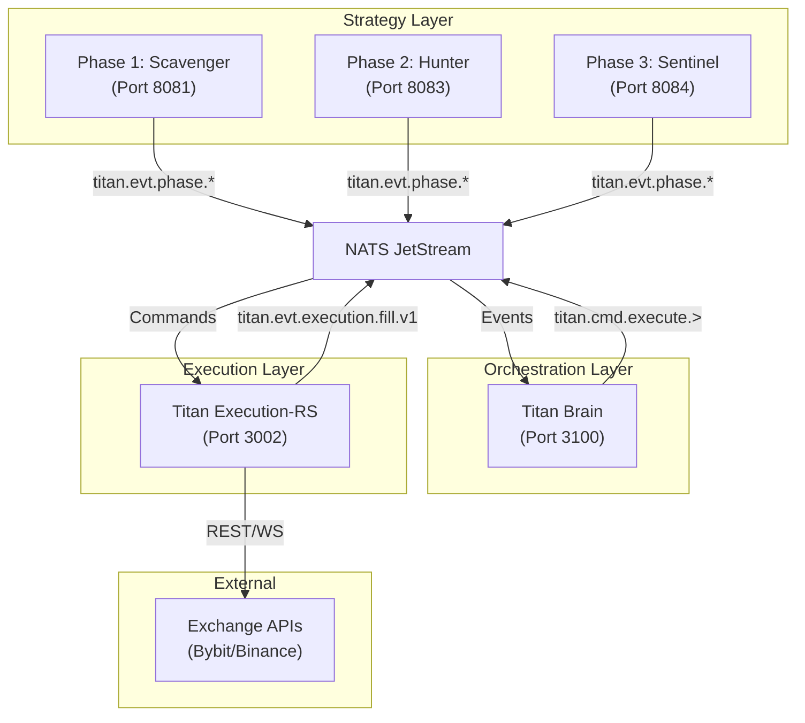

# Titan Trading System: Canonical Source of Truth

> [!IMPORTANT]
> This document is the **single, authoritative source of truth** for the Titan Trading System.
> All statements are derived from repository artifacts at the commit hash specified below.
> Any discrepancy between this document and reality should be resolved in favor of the repository's physical state.
> **Any conflicting doc is non-authoritative.**

---

## 1. Canonical Header

> **Context Map**: See [Knowledge Graph](knowledge-graph.md) and [AI Agent Instructions](ai-readme.md).

| Field                       | Value                                                              |
| --------------------------- | ------------------------------------------------------------------ |
| **Repository Name**         | `titan` (peycheff-com/titan-trading-system)                        |
| **Default Branch**          | `main`                                                             |
| **Commit Hash**             | `a77c842f9af7953cec76954d6d2696cf4ac7ca0d`                         |
| **Generation Timestamp**    | 2026-02-10T20:02:00Z                                               |
| **Node.js Version**         | v22.19.0                                                           |
| **NPM Version**             | 11.6.2                                                             |
| **Rust Toolchain**          | rustc 1.89.0 (29483883e 2025-08-04)                                |
| **Cargo Version**           | 1.89.0 (c24e10642 2025-06-23)                                      |
| **Document SHA256**         | Compute via: `shasum -a 256 docs/system-source-of-truth.md` |

---

## 2. System Invariants (Non-negotiables)

These are the **inviolable rules** governing the Titan system. Each invariant is backed by **symbol-based evidence** (not line numbers) for resilience to refactoring.

> [!NOTE]
> Evidence references use symbol names to survive code changes. Verify via: `grep -r "SymbolName" path/to/file`

| ID    | Invariant                                                                                                       | Evidence (Symbol-Based)                                               |
| ----- | --------------------------------------------------------------------------------------------------------------- | --------------------------------------------------------------------- |
| I-01  | All trading signals MUST be mediated through Titan Brain before reaching Execution                              | `ExecutionPipeline.process_intent()` in `nats_engine.rs`              |
| I-02  | HMAC_SECRET is **fail-closed**: empty secret = `panic!` in production                                           | `HmacValidator::new()` panic block in `security.rs`                   |
| I-03  | Risk Policy hash MUST match between TypeScript and Rust at boot                                                 | `RiskPolicy.computeHash()` in TS, `RiskPolicy::get_hash()` in Rust    |
| I-04  | Symbol whitelist is the sole source of tradeable pairs                                                          | `symbolWhitelist` field in `packages/shared/risk_policy.json`         |
| I-05  | All phase services (Scavenger, Hunter, Sentinel) require Brain approval before execution                        | `publish` ACLs in `config/nats.conf` (titan.cmd.* subjects)           |
| I-06  | Circuit breaker activation is final until operator ARM command with HMAC signature                              | `GlobalHaltState.set_halt()` + `validate_risk_command()` in `security.rs` |
| I-07  | Execution engine only processes intents from `titan.cmd.execution.>` subjects                                   | Consumer `EXECUTION_CORE` filter in `nats_engine.rs`                  |
| I-08  | JetStream streams are authoritative for event persistence (`TITAN_CMD`, `TITAN_EVT`)                            | Stream init in `NatsClient.ensureJetStreamResources()` (TS) and `nats_engine.rs` |
| I-09  | Envelope signatures require `ts`, `nonce`, and `sig` fields; missing any = rejection                            | `HmacValidator::validate()` field checks in `security.rs`             |
| I-10  | Timestamp drift tolerance is 5 minutes (300,000ms) by default                                                   | `HMAC_TIMESTAMP_TOLERANCE` env var parsed in `HmacValidator::new()`   |
| I-11  | Rate limiting enforced via TokenBucket in Rust (default 10 RPS for Bybit)                                       | `struct TokenBucket` in `rate_limiter.rs`                             |
| I-12  | RiskGuard is final veto before order submission; it evaluates policy + shadow state                             | `RiskGuard::evaluate()` in `risk_guard.rs`                            |
| I-13  | NATS users have granular publish/subscribe ACLs preventing cross-service impersonation                          | `authorization { users [ ... ] }` block in `config/nats.conf`         |
| I-14  | Database tables use Row Level Security (RLS) enabled by default                                                 | `ALTER TABLE ... ENABLE ROW LEVEL SECURITY` in `schema.sql`           |
| I-15  | `fills` and `event_log` tables are partitioned by month for performance and retention                           | `PARTITION BY RANGE` in `schema.sql` table definitions                |
| I-16  | Circuit breaker states are: Normal → Cautious → Defensive → Emergency                                          | `pub enum RiskState` in `risk_policy.rs`                              |
| I-17  | All services must expose `/health` endpoint for orchestration health checks                                     | `healthcheck` directives in `docker-compose.prod.yml`                 |
| I-18  | Phase services broadcast state via `titan.evt.phase.*` subjects                                                 | `publish: ["titan.evt.phase.*"]` ACLs in `config/nats.conf`           |
| I-19  | DLQ (Dead Letter Queue) exists at `titan.dlq.execution.core`                                                    | `DLQ_EXECUTION_CORE` constant in `subjects.rs`                        |
| I-20  | Risk policy embedded at Rust compile time via `include_str!`                                                    | `const RISK_POLICY_JSON: &str = include_str!()` in `risk_policy.rs`   |

---

## 3. Organism Topology

### 3.1 Service Inventory

| Service                     | Language   | Port  | Entrypoint                                      | Dockerfile                                         |
| --------------------------- | ---------- | ----- | ----------------------------------------------- | -------------------------------------------------- |
| **titan-brain**             | TypeScript | 3100  | `services/titan-brain/src/index.ts`             | `services/titan-brain/Dockerfile`                  |
| **titan-execution-rs**      | Rust       | 3002  | `services/titan-execution-rs/src/main.rs`       | `services/titan-execution-rs/Dockerfile`           |
| **titan-phase1-scavenger**  | TypeScript | 8081  | `services/titan-phase1-scavenger/src/index.tsx` | `services/titan-phase1-scavenger/Dockerfile`       |
| **titan-phase2-hunter**     | TypeScript | 8083  | `services/titan-phase2-hunter/src/index.ts`     | `services/titan-phase2-hunter/Dockerfile`          |
| **titan-phase3-sentinel**   | TypeScript | 8084  | `services/titan-phase3-sentinel/src/index.tsx`  | `services/titan-phase3-sentinel/Dockerfile`        |
| **titan-ai-quant**          | TypeScript | 8082  | `services/titan-ai-quant/src/index.ts` (lib)    | `services/titan-ai-quant/Dockerfile`               |
| **titan-powerlaw-lab**      | TypeScript | -     | `services/titan-powerlaw-lab/src/main.ts`       | `services/titan-powerlaw-lab/Dockerfile`           |
| **titan-console**           | React/Vite | 3001  | `apps/titan-console/`                           | `apps/titan-console/Dockerfile`                    |

### 3.2 Infrastructure Services (docker-compose.prod.yml)

| Service      | Image               | Port(s)       | Purpose                                |
| ------------ | ------------------- | ------------- | -------------------------------------- |
| `traefik`    | traefik:v3.0        | 80, 443       | Reverse proxy, TLS termination         |
| `nats`       | nats:2.10.22-alpine | 4222, 8222    | Event bus, JetStream persistence       |
| `postgres`   | postgres:16-alpine  | 5432          | Primary truth ledger                   |
| `redis`      | redis:alpine        | 6379          | Idempotency cache, distributed state   |
| `prometheus` | prom/prometheus     | 9090          | Metrics collection                     |
| `grafana`    | grafana/grafana     | 3000          | Observability dashboards               |
| `titan-tempo`| grafana/tempo       | 3200, 4317    | Distributed tracing (4317=OTLP/gRPC)  |

### 3.3 Signal Flow Diagram



---

## 4. Build & Boot Truth Graph

### 4.1 Monorepo Structure

```text
titan/
├── apps/
│   └── titan-console/          # React/Vite frontend
├── packages/
│   └── shared/                 # @titan/shared (schemas, messaging, config)
└── services/
    ├── titan-brain/            # TypeScript orchestrator
    ├── titan-execution-rs/     # Rust execution engine
    ├── titan-phase1-scavenger/ # Phase 1 strategy
    ├── titan-phase2-hunter/    # Phase 2 strategy
    ├── titan-phase3-sentinel/  # Phase 3 strategy
    ├── titan-ai-quant/         # AI optimization library
    └── titan-powerlaw-lab/     # Power law analysis
```

### 4.2 Build Commands

| Command                          | Purpose                                    | Evidence                        |
| -------------------------------- | ------------------------------------------ | ------------------------------- |
| `npm run build`                  | Build all TS services via Turbo + provenance | `package.json:32`              |
| `npm run start:brain`            | Start Brain service                        | `package.json:13`               |
| `npm run start:execution`        | Build + run Rust execution (release)       | `package.json:14`               |
| `npm run start:prod`             | Production startup script                  | `package.json:22` → `scrip../start_production.sh` |
| `cargo build --release`          | Production Rust binary                     | `services/titan-execution-rs/Cargo.toml` |

### 4.3 Dev vs Prod Boot

**Development:**

```bash
docker compose up -d nats postgres redis
npm run start:brain
npm run start:execution
npm run start:console
```

**Production:**

```bash
docker compose -f docker-compose.prod.yml up -d
# OR
npm run start:prod  # Runs scrip../start_production.sh
```

### 4.4 CI Pipeline (7 Jobs)

| Job                 | Description                                   | Status   | Evidence                     |
| ------------------- | --------------------------------------------- | -------- | ---------------------------- |
| `config-validation` | Validates configuration schemas               | Required | `.github/workflows/ci.yml:13-31` |
| `sota-checks`       | Zombie deps, circular deps, immutability, knip | Required | `.github/workflows/ci.yml:36-78` |
| `security-scan`     | NPM audit, cargo audit, SBOM generation       | Required | `.github/workflows/ci.yml:83-137` |
| `contract-check`    | Schema drift detection                        | Required | `.github/workflows/ci.yml:142-157` |
| `node-services`     | Lint, test, build for 7 TS services           | Required | `.github/workflows/ci.yml:162-213` |
| `rust-services`     | fmt, clippy, test, build for execution-rs     | Required | `.github/workflows/ci.yml:218-265` |
| `status-check`      | Final gate aggregation                        | Required | `.github/workflows/ci.yml:270-289` |
| `deploy-production` | VPS Deployment Strategy (Blue/Green-ish)      | CD Only  | `.github/workflows/deploy-prod.yml`|

### 4.5 Live vs Dead Scripts

| Script Category | Examples                                           | Status |
| --------------- | -------------------------------------------------- | ------ |
| **Live**        | `sota:*`, `start:*`, `build`, `test`, `lint`       | Active |
| **Deprecated**  | None identified                                    | -      |

---

## 5. Configuration Canon

### 5.1 Environment Variables (Critical)

| Variable                | Required | Purpose                              | Source                  |
| ----------------------- | -------- | ------------------------------------ | ----------------------- |
| `HMAC_SECRET`           | **Yes**  | Command signing (fail-closed)        | `.env` / Vault          |
| `TITAN_MASTER_PASSWORD` | **Yes**  | Operator authentication              | `.env` / Vault          |
| `DATABASE_URL`          | **Yes**  | Postgres connection string           | `.env`                  |
| `NATS_URL`              | **Yes**  | NATS server address                  | `.env`                  |
| `NATS_USER`             | **Yes**  | NATS authentication                  | `.env`                  |
| `NATS_PASS`             | **Yes**  | NATS authentication                  | `.env`                  |
| `BYBIT_API_KEY`         | **Yes**  | Exchange credentials                 | `.env` / Vault          |
| `BYBIT_API_SECRET`      | **Yes**  | Exchange credentials                 | `.env` / Vault          |
| `BINANCE_API_KEY`       | Trade    | Exchange credentials (optional)      | `.env`                  |
| `REDIS_URL`             | **Yes**  | Redis for idempotency                | `.env`                  |

**Evidence:** `.env.example:1-177`

### 5.2 Configuration Files

| File                                | Purpose                           | Hash (SHA256)                                                      |
| ----------------------------------- | --------------------------------- | ------------------------------------------------------------------ |
| `docker-compose.prod.yml`           | Production orchestration          | `f5957a020975044ad2500e8c88d62fffc5e92fef8d30a7cc4e9e65fbebf33701` |
| `docker-compose.yml`                | Development orchestration         | `4e002c4d03e329539fba06b6fb41b27337150f5091f003b4e94f792495f9ce93` |
| `packages/shared/risk_policy.json`  | Canonical risk policy             | `d4fb422e7c5ff4dd7410b254e9dc2cd1c892fd013adb2fa59dec6445a958a2c1` |
| `config/nats.conf`                  | NATS server + ACL configuration   | `42b0a657e815a911688710bfa9776eeb4bc7215c635d99bf787c5e3851b74971` |
| `services/titan-brain/src/db/schema.sql` | Database schema              | `aa1b8369ecb230b1a1809f52c482f6f48a734df4393dc4ce74c474259bfe0bd0` |

### 5.3 Single Source of Truth per Domain

| Domain               | Source                                         | Loaded By                                  |
| -------------------- | ---------------------------------------------- | ------------------------------------------ |
| Risk Policy          | `packages/shared/risk_policy.json`             | TS: Zod parse, Rust: `include_str!`        |
| NATS Subjects        | `packages/shared/src/messaging/powerlaw_subjects.ts` | All services import                   |
| Fee Schedule         | `packages/shared/fee_schedule.json`            | Brain, Execution                           |
| Database Schema      | `services/titan-brain/src/db/schema.sql`       | Brain migrations                           |
| Exchange Credentials | `.env` / Vault                                 | All services via `loadSecretsFromFiles()`  |

---

## 6. Event Bus Canon (NATS JetStream)

### 6.1 Stream Definitions

| Stream Name       | Subjects             | Retention          | Evidence                                     |
| ----------------- | -------------------- | ------------------ | -------------------------------------------- |
| `TITAN_COMMANDS`  | `titan.cmd.>`        | WorkQueue          | `packages/shared/src/messaging/NatsClient.ts:175-183` |
| `TITAN_EVENTS`    | `titan.evt.>`        | **Limits**         | `packages/shared/src/messaging/NatsClient.ts:184-191` |
| `TITAN_DATA`      | `titan.data.>`       | **Limits**         | `packages/shared/src/messaging/NatsClient.ts:192-197` |
| `TITAN_SIGNALS`   | `titan.signal.>`     | Limits           | **DEPRECATED** — No longer initialized in code. Scheduled for removal. |

> [!NOTE]
> Additional connectivity-layer streams (`TITAN_VENUE_STATUS`, `TITAN_MARKET_TRADES`) are defined in [connectivity/nats-topology.md](connectivity/nats-topology.md).

### 6.2 Subject Namespace Map

| Subject Pattern                | Publisher(s)          | Subscriber(s)           | Type      | Payload Schema                |
| ------------------------------ | --------------------- | ----------------------- | --------- | ----------------------------- |
| `titan.cmd.execution.place.v1.>`| Brain                 | Execution               | Command   | `IntentEnvelope`              |
| `titan.evt.execution.fill.v1`  | Execution             | Brain, Console          | Event     | `FillEvent`                   |
| `titan.evt.scavenger.signal.v1`| Scavenger             | Brain                   | Signal    | `PhaseDiagnostics`            |
| `titan.evt.hunter.>`           | Hunter                | Brain                   | Signal    | `IntentSignal`                |
| `titan.evt.sentinel.>`         | Sentinel              | Brain                   | Signal    | `ArbitrageSignal`             |
| `titan.evt.phase.*`            | All phases            | Brain                   | Telemetry | `PhasePosture`                |
| `powerlaw.metrics.*`           | PowerLaw Lab          | All phases, Quant       | Data      | `PowerLawMetrics`             |
| `titan.ai.*`                   | AI Quant, PowerLaw    | Hunter, Brain           | Data      | Various                       |
| `titan.evt.budget.update`      | Brain                 | All phases              | Event     | `BudgetUpdate`                |
| `titan.cmd.risk.*`             | Brain                 | Execution               | Command   | `RiskCommand`                 |
| `titan.cmd.sys.halt.v1`            | Brain/Operator        | Execution               | Command   | `HaltPayload`                 |

### 6.3 NATS ACL Matrix

| User        | Publish Permissions                                      | Subscribe Permissions                                   |
| ----------- | -------------------------------------------------------- | ------------------------------------------------------- |
| `brain`     | `>` (full)                                               | `>` (full)                                              |
| `execution` | `titan.evt.execution.fill.v1`, `titan.evt.execution.>`, `titan.evt.phase.>` | `titan.cmd.execution.place.v1.>`, `titan.cmd.risk.>`, `titan.cmd.sys.halt.v1`|
| `scavenger` | `titan.evt.scavenger.signal.v1`, `titan.evt.phase.>`     | `powerlaw.metrics.>`, `titan.evt.budget.update.v1`      |
| `hunter`    | `titan.evt.hunter.>`, `titan.evt.phase.>`                | `titan.cmd.hunter.>`, `powerlaw.metrics.>`              |
| `sentinel`  | `titan.evt.sentinel.>`, `titan.evt.phase.>`              | `titan.cmd.sentinel.>`, `powerlaw.metrics.>`            |
| `powerlaw`  | `titan.evt.powerlaw.>`, `titan.data.powerlaw.>`, `titan.ai.>`| `titan.data.market.>`, `titan.evt.>`                    |
| `quant`     | `titan.evt.quant.>`, `titan.cmd.ai.>`                    | `titan.cmd.ai.>`, `titan.evt.>`, `titan.data.powerlaw.>`|
| `console`   | `$JS.API.>`                                              | `titan.data.>`, `titan.evt.>`, `_INBOX.>`               |

**Evidence:** `config/nats.conf:22-101`

### 6.4 Message Envelope Schema

**Required Fields (IntentEnvelope):**

- `type`: Message type identifier
- `payload`: Actual message content
- `source`: Origin service identifier
- `ts`: Unix timestamp (milliseconds)
- `nonce`: Unique request identifier
- `sig`: HMAC-SHA256 signature (hex)

**Evidence:** `packages/shared/src/schemas/intentSchema.ts`

---

## 7. Data Truth (PostgreSQL)

### 7.1 Table Ownership

| Table                     | Owner Service | Purpose                                      | Partitioned | RLS     |
| ------------------------- | ------------- | -------------------------------------------- | ----------- | ------- |
| `allocation_history`      | Brain         | Tracks phase allocation changes              | No          | Enabled |
| `phase_trades`            | Brain         | Individual trade records per phase           | No          | Enabled |
| `phase_performance`       | Brain         | Aggregated performance metrics               | No          | Enabled |
| `brain_decisions`         | Brain         | Signal approval/rejection audit trail        | No          | Enabled |
| `treasury_operations`     | Brain         | Capital movement ledger                      | No          | Enabled |
| `circuit_breaker_events`  | Brain         | Breaker activation log                       | No          | Enabled |
| `risk_snapshots`          | Brain         | Periodic risk state captures                 | No          | Enabled |
| `high_watermark`          | Brain         | Peak equity tracking                         | No          | Enabled |
| `system_state`            | Brain         | Recovery checkpointing (JSONB)               | No          | Enabled |
| `manual_overrides`        | Brain         | Operator allocation interventions            | No          | Enabled |
| `operators`               | Brain         | User credentials and permissions             | No          | Enabled |
| `fills`                   | Brain         | Trade execution records                      | **Yes**     | Enabled |
| `event_log`               | Brain         | Event sourcing journal                       | **Yes**     | Enabled |
| `ledger_accounts`         | Brain         | Double-entry accounting accounts             | No          | Enabled |
| `ledger_transactions`     | Brain         | Accounting transaction headers               | No          | Enabled |
| `ledger_entries`          | Brain         | Accounting debit/credit entries              | No          | Enabled |

### 7.2 Migration System

| Aspect            | Value                                          |
| ----------------- | ---------------------------------------------- |
| **Location**      | `services/titan-brain/migrations/`             |
| **System**        | Idempotent runner (`scripts/ops/run_migrations.sh`) with `_titan_migrations` tracking table (SHA256 drift detection) |
| **Current Schema**| `services/titan-brain/src/db/schema.sql`       |
| **CI Validation** | `scripts/ci/test_fresh_bootstrap.sh` (ephemeral Postgres → migrate → validate → idempotency proof) |

### 7.3 Migrations

| Migration File                | Purpose                              |
| ----------------------------- | ------------------------------------ |
| `003_dedup_fills.sql`         | Fill deduplication constraints       |
| `004_performance_view.sql`    | Performance aggregation views        |
| `20240523_canary_config.sql`  | Canary deployment configuration      |

---

## 8. Risk Immune System

### 8.1 Canonical Risk Policy

**Source File:** `packages/shared/risk_policy.json`  
**SHA256 Hash:** `d4fb422e7c5ff4dd7410b254e9dc2cd1c892fd013adb2fa59dec6445a958a2c1`

```json
{
  "maxAccountLeverage": 10.0,
  "maxPositionNotional": 50000.0,
  "maxDailyLoss": -1000.0,
  "maxOpenOrdersPerSymbol": 5,
  "symbolWhitelist": ["BTC/USDT", "ETH/USDT", "SOL/USDT"],
  "maxSlippageBps": 100,
  "maxStalenessMs": 5000,
  "maxCorrelation": 0.7,
  "correlationPenalty": 0.5,
  "minConfidenceScore": 0.7,
  "minStopDistanceMultiplier": 1.5,
  "version": 1,
  "lastUpdated": 0
}
```

### 8.2 Policy Enforcement Points

| Layer              | File                                                   | Method                     |
| ------------------ | ------------------------------------------------------ | -------------------------- |
| Strategy (TS)      | `packages/shared/src/schemas/RiskPolicy.ts:5-26`       | Zod schema validation      |
| Execution (Rust)   | `services/titan-execution-rs/src/risk_policy.rs:17-75` | Serde deserialization      |
| Hash Verification  | Both layers compute SHA256; mismatch = abort           | `getCanonicalRiskPolicy()`, `RiskPolicy::get_hash()` |

### 8.3 Circuit Breaker States

| State        | Trigger Condition                          | Effect                           |
| ------------ | ------------------------------------------ | -------------------------------- |
| `Normal`     | All metrics within bounds                  | Full trading enabled             |
| `Cautious`   | 50% daily drawdown limit consumed          | Position sizing reduced 50%      |
| `Defensive`  | 75% daily drawdown limit consumed          | New positions blocked            |
| `Emergency`  | Max daily loss breached OR operator halt   | All positions flattened          |

**Evidence:** `services/titan-execution-rs/src/risk_policy.rs:8-15`

### 8.4 Kill Switches

| Mechanism         | Trigger                                | Evidence                                    |
| ----------------- | -------------------------------------- | ------------------------------------------- |
| `GlobalHalt`      | Operator command via `titan.cmd.sys.halt.v1` | `services/titan-execution-rs/src/circuit_breaker.rs` |
| `ArmedState`      | Disarm command prevents new orders     | `services/titan-execution-rs/src/armed_state.rs` |
| `RiskGuard`       | Policy violation                       | `services/titan-execution-rs/src/risk_guard.rs` |

---

## 9. Execution Boundary and Order Lifecycle

### 9.1 Boundary Contract

```text
┌─────────────────┐         ┌──────────────────┐         ┌─────────────────┐
│  Strategy/Brain │ ──CMD──▶│  titan-execution │ ──REST──▶│    Exchange     │
│   (Orchestration)│◀──EVT── │      (Rust)      │◀──WS──── │   (Bybit/Binance) │
└─────────────────┘         └──────────────────┘         └─────────────────┘
```

### 9.2 Allowed vs Forbidden Channels

| Channel Type      | Allowed                              | Forbidden                          |
| ----------------- | ------------------------------------ | ---------------------------------- |
| Trade Intent      | NATS `titan.cmd.execution.place.v1.>` | Direct HTTP to exchange from Brain |
| Fill Events       | NATS `titan.evt.execution.fill.v1`   | Database writes from Execution     |
| Risk Commands     | NATS `titan.cmd.risk.*`              | Direct gRPC/HTTP bypass            |

### 9.3 Order Lifecycle

1. **Signal Generated** (Phase 1/2/3) → Published to `titan.evt.*`
2. **Brain Approval** → Validates against policy, allocations
3. **Command Published** → `titan.cmd.execution.place.v1.{venue}.{account}.{symbol}`
4. **HMAC Validated** (Execution) → `security.rs:64-128`
5. **Risk Guard Check** → `risk_guard.rs:130-198`
6. **Order Submitted** → Exchange adapter
7. **Fill Received** → Published to `titan.evt.execution.fill.v1`
8. **Brain Records** → Fills table + event log

### 9.4 Idempotency Rules

| Mechanism         | Implementation                              | Evidence                                     |
| ----------------- | ------------------------------------------- | -------------------------------------------- |
| Signal ID Cache   | Redis-backed, TTL 5 minutes                 | `.env.example:176` (`SIGNAL_CACHE_TTL_MS`)   |
| Nonce Tracking    | Envelope nonce prevents replay              | `security.rs:78`                             |
| Order Dedup       | Fill ID unique constraint                   | `schema.sql:157` (`fill_id` in PRIMARY KEY)  |

### 9.5 Truth Layer Definition

**"Verified" status requires:**

1. Fill confirmed by exchange WebSocket ACK
2. Fill recorded in `fills` table with `t_exchange` timestamp
3. Fill event published to NATS

**Evidence:** `services/titan-execution-rs/src/nats_engine.rs` (fill publishing logic)

---

## 10. Observability and Operability

### 10.1 Health Endpoints

### NATS Subjects (Auto-Generated)
<!-- AUTH_SUBJECT_MAP_START -->
| Constant Path | Subject Pattern |
|---------------|-----------------|
| `CMD.EXECUTION.PLACE` | `Function(...args)` |
| `CMD.EXECUTION.PREFIX` | `titan.cmd.execution.place.v1` |
| `CMD.EXECUTION.ALL` | `titan.cmd.execution.place.v1.>` |
| `CMD.ALL` | `titan.cmd.execution.place.v1.>` |
| `CMD.RISK.CONTROL` | `titan.cmd.risk.control.v1` |
| `CMD.RISK.FLATTEN` | `titan.cmd.risk.flatten` |
| `CMD.RISK.POLICY` | `titan.cmd.risk.policy.v1` |
| `CMD.CONFIG.ROLLBACK` | `titan.cmd.config.rollback` |
| `CMD.OPERATOR.ARM` | `titan.cmd.operator.arm.v1` |
| `CMD.OPERATOR.DISARM` | `titan.cmd.operator.disarm.v1` |
| `CMD.OPERATOR.ALL` | `titan.cmd.operator.v1.>` |
| `CMD.SYS.HALT` | `titan.cmd.sys.halt.v1` |
| `CMD.HUNTER.ALL` | `titan.cmd.hunter.v1.>` |
| `CMD.SENTINEL.ALL` | `titan.cmd.sentinel.v1.>` |
| `CMD.AI.OPTIMIZE` | `titan.cmd.ai.optimize.v1` |
| `CMD.AI.OPTIMIZE_PROPOSAL` | `titan.cmd.ai.optimize.proposal.v1` |
| `CMD.AI.ALL` | `titan.cmd.ai.v1.>` |
| `EVT.ANALYSIS.TRADE_COMPLETED` | `titan.evt.analysis.trade_completed.v1` |
| `EVT.ALERT.DRIFT` | `titan.evt.alert.drift.v1` |
| `EVT.ALERT.INTEGRITY` | `titan.evt.alert.integrity.v1` |
| `EVT.ALERT.LATENCY` | `titan.evt.alert.latency.v1` |
| `EVT.EXECUTION.FILL` | `titan.evt.execution.fill.v1` |
| `EVT.EXECUTION.SHADOW_FILL` | `titan.evt.execution.shadow_fill.v1` |
| `EVT.EXECUTION.REPORT` | `titan.evt.execution.report.v1` |
| `EVT.EXECUTION.REJECT` | `titan.evt.execution.reject.v1` |
| `EVT.EXECUTION.BALANCE` | `titan.evt.execution.balance` |
| `EVT.EXECUTION.ALL` | `titan.evt.execution.>` |
| `EVT.SCAVENGER.SIGNAL` | `titan.evt.scavenger.signal.v1` |
| `EVT.HUNTER.ALL` | `titan.evt.hunter.>` |
| `EVT.SENTINEL.ALL` | `titan.evt.sentinel.>` |
| `EVT.POWERLAW.IMPACT` | `titan.evt.powerlaw.impact.v1` |
| `EVT.POWERLAW.ALL` | `titan.evt.powerlaw.>` |
| `EVT.QUANT.ALL` | `titan.evt.quant.>` |
| `EVT.PHASE.INTENT` | `titan.evt.phase.intent.v1` |
| `EVT.PHASE.POSTURE` | `titan.evt.phase.posture.v1` |
| `EVT.PHASE.DIAGNOSTICS` | `titan.evt.phase.diagnostics.v1` |
| `EVT.PHASE.ALL` | `titan.evt.phase.>` |
| `EVT.BRAIN.SIGNAL` | `titan.evt.brain.signal.v1` |
| `EVT.BRAIN.REGIME` | `titan.evt.brain.regime.v1` |
| `EVT.ANALYTICS.POWERLAW` | `titan.evt.analytics.powerlaw.v1` |
| `EVT.BUDGET.UPDATE` | `titan.evt.budget.update.v1` |
| `EVT.AUDIT.OPERATOR` | `titan.evt.audit.operator.v1` |
| `EVT.RISK.CORRELATION_WARNING` | `titan.evt.risk.correlation_warning.v1` |
| `EVT.RISK.STATE` | `titan.evt.risk.state.v1` |
| `EVT.SYS.FAILOVER_INITIATED` | `titan.evt.sys.failover_initiated.v1` |
| `EVT.SYS.RESTORE_INITIATED` | `titan.evt.sys.restore_initiated.v1` |
| `DATA.POWERLAW.METRICS` | `Function(...args)` |
| `DATA.POWERLAW.PREFIX` | `titan.data.powerlaw.metrics.v1` |
| `DATA.POWERLAW.ALL` | `titan.data.powerlaw.metrics.v1.>` |
| `DATA.EXECUTION.CONSTRAINTS` | `Function(...args)` |
| `DATA.EXECUTION.PREFIX` | `titan.data.execution.constraints.v1` |
| `DATA.EXECUTION.ALL` | `titan.data.execution.constraints.v1.>` |
| `DATA.MARKET.TICKER` | `Function(...args)` |
| `DATA.MARKET.PREFIX` | `titan.data.market.ticker.v1` |
| `DATA.MARKET.ALL` | `titan.data.market.ticker.v1.>` |
| `DATA.DASHBOARD.UPDATE` | `titan.data.dashboard.update.v1` |
| `SYS.HEARTBEAT` | `Function(...args)` |
| `SYS.RPC.GET_POSITIONS` | `Function(...args)` |
| `SYS.RPC.GET_BALANCES` | `Function(...args)` |
<!-- AUTH_SUBJECT_MAP_END -->

### JetStream Streams

### 10.2 Metrics Endpoints

| titan-execution   | `/metrics`      | Prometheus |
| titan-brain       | `/metrics`      | Prometheus |
| NATS              | `:8222/varz`    | JSON       |

### 10.3 Critical Metrics

| Metric                    | Source            | Alert Threshold          |
| ------------------------- | ----------------- | ------------------------ |
| Position exposure         | Execution         | > 80% of max notional    |
| Account leverage          | Execution         | > 8x (of 10x max)        |
| Daily drawdown            | Brain             | > 50% of `maxDailyLoss` consumed → alert; 100% → Emergency |
| Order latency p99         | Execution         | > 500ms                  |
| HMAC rejection rate       | Execution         | > 1 per minute           |

### 10.4 Log Correlation

| ID Type          | Format                           | Usage                        |
| ---------------- | -------------------------------- | ---------------------------- |
| `signal_id`      | UUID v4                          | End-to-end signal tracking   |
| `correlation_id` | UUID v4                          | Request correlation          |
| `order_id`       | Exchange-provided               | Exchange order tracking      |
| `fill_id`        | Exchange-provided               | Fill deduplication           |

### 10.5 Tracing

OpenTelemetry configured via:

- `opentelemetry-otlp` in Rust (`Cargo.toml:46`)
- Tempo receiver on `4317` (OTLP/gRPC)

---

## 11. Security Canon

### 11.1 HMAC Signing Boundaries

| Boundary                    | What is Signed                           | Where Verified                    |
| --------------------------- | ---------------------------------------- | --------------------------------- |
| Brain → Execution           | `ts.nonce.payload_json`                  | `security.rs:64-128`              |
| Operator → Execution        | `timestamp:action:actor_id:command_id`   | `security.rs:130-184`             |

### 11.2 Fail-Closed Behavior

```rust
// services/titan-execution-rs/src/security.rs:35-49
if secret.is_empty() {
    let allow_empty = env::var("HMAC_ALLOW_EMPTY_SECRET")
        .map(|v| v == "true")
        .unwrap_or(false);
    if allow_empty {
        warn!("⚠️ HMAC_SECRET not set but HMAC_ALLOW_EMPTY_SECRET=true. TEST MODE ONLY.");
    } else {
        panic!("FATAL: HMAC_SECRET environment variable is required.");
    }
}
```

### 11.3 Secret Handling

| Secret                 | Storage           | Load Method                       |
| ---------------------- | ----------------- | --------------------------------- |
| `HMAC_SECRET`          | `.env` / Vault    | `std::env::var()` + panic on miss |
| Exchange API keys      | `.env` / Vault    | `loadSecretsFromFiles()`          |
| `TITAN_MASTER_PASSWORD`| `.env` / Vault    | Brain config loader               |

### 11.4 Rate Limiting

| Service           | Limit                | Implementation                    |
| ----------------- | -------------------- | --------------------------------- |
| titan-execution   | 10 RPS per exchange  | `rate_limiter.rs` (TokenBucket)   |
| Brain API         | 12 RPS               | `.env.example:126`                |

---

## 12. Contradictions and Dual Truth Findings

| ID   | Finding                                                    | Resolution                                           | Status    |
| ---- | ---------------------------------------------------------- | ---------------------------------------------------- | --------- |
| D-01 | Two risk_policy.json files exist                           | Files are **byte-identical** (same SHA256)           | RESOLVED  |
| D-02 | Legacy NATS subjects (`titan.data.*`) vs new (`titan.data.*`) | Migration map exists; both active during transition | DOCUMENTED |
| D-03 | `docker compose config` requires NATS_SYS_PASSWORD         | `validate_prod_env.sh` checks all required vars pre-deploy; `:?` fail-fast syntax in compose | **RESOLVED** |

**Dual Truth Verification:**

```bash
# Verify risk policy files are identical
shasum -a 256 packages/shared/risk_policy.json services/titan-execution-rs/src/risk_policy.json
# Output: d4fb422e... (both files)
```

---

## 13. Dead/Legacy/Unused Inventory

### 13.1 Detected by Knip Analysis

| Item Type           | Path/Pattern                                      | Evidence                           | Action      |
| ------------------- | ------------------------------------------------- | ---------------------------------- | ----------- |
| Unlisted dependency | `@titan/shared` in scripts/verification           | `knip` output                      | Add to deps |
| Unlisted dependency | `globals` in eslint configs                       | `knip` output                      | Add to deps |
| Unlisted binary     | `tsx`, `ts-node`, `python3`                       | `knip` output                      | Add to deps |
| Unused exports      | 220 unused exports (mostly UI components)         | `knip` output                      | Review      |
| Unresolved imports  | `identity-obj-proxy`, `@jest/test-sequencer`      | Jest config issues                 | Fix config  |

### 13.2 Legacy Services

| Service                         | Path                                    | Status      | Action      |
| ------------------------------- | --------------------------------------- | ----------- | ----------- |
| `canonical-powerlaw-service`    | `services/canonical-powerlaw-service/`  | **Deleted** | ✅ Removed  |
| `titan-memory`                  | `services/titan-memory/`                | **Deleted** | ✅ Removed  |

### 13.3 Legacy NATS Subjects

| Subject Pattern      | Status      | Replacement                | Deadline          |
| -------------------- | ----------- | -------------------------- | ----------------- |
| `signal.*`           | Deprecated  | `titan.data.*`             | **Feb 28, 2026**  |

---

## 14. Canonical Artifacts and Hash Ledger

### 14.1 Critical Artifacts (SHA256)

| Artifact                                                   | SHA256                                                             |
| ---------------------------------------------------------- | ------------------------------------------------------------------ |
| `docker-compose.prod.yml`                                  | `f5957a020975044ad2500e8c88d62fffc5e92fef8d30a7cc4e9e65fbebf33701` |
| `docker-compose.yml`                                       | `4e002c4d03e329539fba06b6fb41b27337150f5091f003b4e94f792495f9ce93` |
| `packages/shared/risk_policy.json`                         | `d4fb422e7c5ff4dd7410b254e9dc2cd1c892fd013adb2fa59dec6445a958a2c1` |
| `services/titan-execution-rs/src/risk_policy.json`         | `d4fb422e7c5ff4dd7410b254e9dc2cd1c892fd013adb2fa59dec6445a958a2c1` |
| `config/nats.conf`                                         | `42b0a657e815a911688710bfa9776eeb4bc7215c635d99bf787c5e3851b74971` |
| `services/titan-brain/src/db/schema.sql`                   | `aa1b8369ecb230b1a1809f52c482f6f48a734df4393dc4ce74c474259bfe0bd0` |
| `packages/shared/src/schemas/RiskPolicy.ts`                | `12964aaf9d30f6f4876fa5ff54da8d3035c4556ead4ff9765a5106adac7c2932` |
| `packages/shared/src/messaging/NatsClient.ts`              | `f2e9f3ec1f4fe22b0f2d5dc112a654d071016c572b189f946e89a7d9be5ab9d1` |
| `packages/shared/src/messaging/ExecutionClient.ts`         | `d413c4efa4676dfd5d8fe93ac203ae316e48b4b6b958ea1286d38599a6e8f5f9` |
| `services/titan-execution-rs/src/risk_policy.rs`           | `6808e7ca92f856ffe465f88311be6d8721dd28cb96795eddf4b1e81a725d562e` |
| `services/titan-execution-rs/src/security.rs`              | `624f0384eb51573ede5f94d3783d78a51e93ab8130cad43802dcc4b38cad5d34` |
| `services/titan-execution-rs/src/nats_engine.rs`           | `92bf7301558e51d4320203efa64b526489fa89e2aae1c36974778dcc00c0d6ee` |
| `services/titan-brain/src/index.ts`                        | `b03c71431500b41ac163b05a3e80d5a5095e7b75ff30855c090069e097be1c76` |
| `turbo.json`                                               | `40a2fb5f91c04664d838e8057aa47591000414d44c2465870f93d498377564e7` |
| `.github/workflows/ci.yml`                                 | `46659f81fb57ec1f6245a7c2847a75e91f1649bceaba8012a63b1bfd15c3d2de` |
| `.github/workflows/deploy-prod.yml`                        | `7e455b9a699af2924128f2bc3382cbf0d11d3eae3d5c3b60d7acf55947b67593` |

### 14.2 Hash Computation Command

```bash
shasum -a 256 <file>
```

---

## 15. Closure Tasks

| ID   | Task                                                                 | Priority | Evidence Trigger                                |
| ---- | -------------------------------------------------------------------- | -------- | ----------------------------------------------- |
| C-01 | Add `@titan/shared` to dependencies in verification scripts         | Medium   | Knip unlisted dependency warning                |
| C-02 | Add missing binaries (`tsx`, `ts-node`, `python3`) to package.json   | Low      | Knip unlisted binaries warning                  |
| C-05 | Complete NATS subject migration from `titan.data.*` to `titan.data.*` | High  | `powerlaw_subjects.ts:77` deprecation notice    |
| C-06 | Review 220 unused exports identified by Knip                         | Low      | Knip unused exports output                      |
| C-07 | Set `NATS_SYS_PASSWORD` environment variable for production          | **RESOLVED** | `validate_prod_env.sh` + fail-fast `:?` syntax |

---

## 16. Mandatory Command Evidence

### 16.1 git rev-parse HEAD

```text
a77c842f9af7953cec76954d6d2696cf4ac7ca0d
```

### 16.2 git status --porcelain

```bash
M knip.json
M package-lock.json
M package.json
M services/titan-ai-quant/package.json
M services/titan-phase2-hunter/package.json
M services/titan-phase3-sentinel/package.json
```

### 16.3 npm run (script inventory)

```text
start:brain, start:execution, start:console, start:scavenger, 
start:hunter, start:sentinel, start:powerlaw-lab, start:ai-quant,
start:prod, build, test:all, lint:all, lint:fix, format, format:check,
validate:config, sota:circular, sota:arch, sota:complexity, sota:god,
sota:dead, sota:zombie, sota:secrets, sota:flake, sota:immutability,
sota:audit, sota:license, ... (60+ scripts)
```

### 16.4 docker compose config

```text
Passes when .env contains all required variables.
validate_prod_env.sh enforces 14 required vars + rejects known defaults.
```

### 16.5 cargo metadata

```text
Package: titan-execution-rs v0.1.0
Dependencies: tokio, async-nats, serde, actix-web, hmac, sha2, 
              opentelemetry, prometheus, crossbeam-channel, etc.
```

---

## Document Verification

To verify this document against the repository state:

```bash
# 1. Verify commit hash
git rev-parse HEAD | grep -q "a77c842f9af7953cec76954d6d2696cf4ac7ca0d" && echo "✓ Commit matches"

# 2. Verify critical artifact hashes
shasum -a 256 packages/shared/risk_policy.json services/titan-execution-rs/src/risk_policy.json | \
  grep -c "d4fb422e7c5ff4dd7410b254e9dc2cd1c892fd013adb2fa59dec6445a958a2c1" | \
  grep -q 2 && echo "✓ Risk policy parity confirmed"

# 3. Run configuration validation
npm run validate:config

# 4. Verify NATS ACLs
grep -c "user:" config/nats.conf  # Should return 8 users
```

---

## 10.6 Reconciliation & Truth Convergence

> [!IMPORTANT]
> **Production Standard**: Truth is not just "Event Emitted", it is "Exchange Acknowledged and Verified".

The system implements a rigorous **Reconciliation Loop** to survive WebSocket disconnects and state drift:

1. **Scheduled Reconcile**: Every 1 minute, Brain queries the Exchange REST API for open orders and positions.
2. **Snapshot Digest**: Brain creates a `PositionSnapshot` containing the authoritative state.
3. **Drift Detection**:
    - If `Brain State` != `Exchange State`, it enters **Truth Degrade Mode**.
    - **Action**: All Risk limits are frozen (no new risk).
    - **Self-Healing**: Brain emits synthetic checks or alerts operator if manual intervention is needed.
4. **Hard Proof Test**:
    - The system MUST demonstrate convergence without manual cleanup after a simulated 5-minute network partition during active trading.

---

**Document Generated**: 2026-02-10T20:02:00Z  
**Generator**: Canonical System Cartographer (AI-Assisted)  
**Verification Status**: Evidence-backed from repository artifacts
